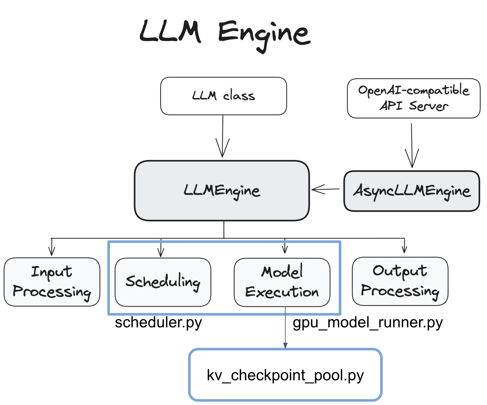

# Ferry — Implementation & Demo Guide (CSE 232)

Reference for the Implementation and Demo parts of the talk.
Scope: the core substrate changes in vLLM only (experiment scripts and the
exploratory SLO picker are excluded).

---

## 1. Code changes (relative to vanilla vLLM)


New subsystem:

`kv_checkpoint_pool.py`: keep KV in CPU memory (save / load)

Modified vLLM path:

`scheduler.py`: resume from a checkpoint, not re-prefill

`gpu_model_runner.py`: save KV each step, load it back on resume

`core.py`: share engine status, move requests across engines

### 1. `vllm/v1/core/kv_checkpoint_pool.py` — **NEW file (758 lines)**
The whole "store KV in CPU memory and read it back" subsystem; vLLM did not
have this. It contains:
- `save_checkpoint()` — copy a request's finished KV blocks from GPU to CPU
  RAM (only the blocks that are new since last time); runs on a dedicated
  CUDA stream so it does not slow down decoding.
- `restore_checkpoint()` — copy the saved KV blocks back from CPU to GPU and
  rebuild the paged layout.
- a **manifest** — records, per request, how many tokens are saved and which
  CPU buffer holds each block.
- **eviction** — drop the oldest entries when CPU memory fills up.

### 2. `vllm/v1/worker/gpu_model_runner.py` — **MODIFIED (~830 lines)**
The file that actually runs the model on the GPU. We added three things to
the existing flow:
- create the checkpoint store at startup;
- after every decode step, save the KV blocks that just finished to CPU;
- on resume, call `restore_checkpoint` to bring a request's KV back from CPU
  to GPU.
The model computation itself is untouched — we only added the save/read calls
and a few new functions around it.

### 3. `vllm/v1/core/sched/scheduler.py` — **MODIFIED (~170 lines)**
The file that decides which requests run each step. Vanilla vLLM knows two kinds
of work: a brand-new request, which prefills the whole prompt, and a preempted
request, which also recomputes from the start. We taught it a third kind: a
request that resumes from a host checkpoint. When a paused (or rerouted) request
comes back, the scheduler admits it from its checkpointed token offset and
continues, replaying only the few uncovered tokens, instead of re-prefilling the
prompt. The same reload path also covers the capacity case: when GPU memory is
full and a request must be evicted, a request that has a checkpoint is sent down
this reload path instead of being recomputed.

### 4. `vllm/v1/engine/core.py` — **MODIFIED (~190 lines)**
The engine's main loop. We added:
- each engine writes its own status (requests running, memory used) to shared
  memory;
- it scans a shared-memory queue to see if any request should move to another
  engine — this is what supports cross-engine transfer and failure recovery.

### Also
- Inter-process communication uses 4 directories under `/dev/shm`:
  `vllm_ft_checkpoints` (saved KV), `vllm_ft_req_map` (request map),
  `vllm_ft_engine_status` (engine status), `vllm_ft_preempt_queue`
  (transfer queue).
- **No CUDA kernels written or modified.** We only use PyTorch's CUDA Python
  API: a dedicated `torch.cuda.Stream`, CUDA events (`record_event` /
  `wait_event`) to overlap the GPU→CPU copy with decoding, and pinned-memory
  async copies (`.pin_memory()`, `.copy_(non_blocking=True)`).
- **Unchanged:** model forward pass, attention kernels, the paged-KV storage
  layout, tokenizer.

**Totals:** ~758 new + ~1,190 modified ≈ **~1,950 lines**, all in vLLM's KV path.

---

## 2. Key logic — simplified pseudocode

### `kv_checkpoint_pool.py` (NEW) — save + restore
```python
# ---- save: GPU KV blocks -> CPU RAM, async, overlapped with decode ----
def save_checkpoint(req_id, gpu_kv, block_ids):
    # only copy blocks that are NEW since this request's last save
    delta = block_ids[prev_saved_count(req_id):]

    # copy runs on a SEPARATE cuda stream; it waits for the decode
    # stream to finish writing these blocks, but decode never waits
    # on the copy -> the two overlap
    ev = torch.cuda.current_stream().record_event()
    with torch.cuda.stream(copy_stream):
        copy_stream.wait_event(ev)
        for layer in range(num_layers):
            src = gpu_kv[layer][:, delta]                 # gather this layer's blocks
            pinned[layer].copy_(src, non_blocking=True)   # GPU -> pinned host

    append_to_host_store(req_id, pinned)                  # K/V tensors per layer
    manifest[req_id] = (generation, covered_tokens, gpu_block -> host_block map)

# ---- restore: CPU RAM -> GPU, on resume ----
def restore_checkpoint(req_id, gpu_kv, target_blocks):
    entry = host_store[req_id]                            # nothing on GPU needed
    with torch.cuda.stream(copy_stream):
        for layer in range(num_layers):
            gpu_kv[layer][:, target_blocks] = entry.host[layer].to(gpu)  # host -> GPU
    return entry.covered_tokens
```

### `gpu_model_runner.py` (MODIFIED) — save each step / read on resume
```python
def execute_model(...):
    outputs = run_forward(...)            # <-- vanilla vLLM, UNCHANGED

    # NEW: after each decode step, publish newly-finished KV blocks
    for req in running:
        new_blocks = blocks_completed_since_last_gen(req)
        if new_blocks:
            checkpoint_pool.save_checkpoint(req.id, gpu_kv, new_blocks)
    return outputs

def resume_request(req):                  # NEW path (instead of re-prefill)
    fresh = allocate_gpu_blocks(req)
    n = checkpoint_pool.restore_checkpoint(req.id, gpu_kv, fresh)
    update_block_table(req, fresh)        # vLLM's existing block-table / slot-mapping
    replay(req, from_token=n)             # only the few tokens after last save
```

### `sched/scheduler.py` (MODIFIED) — resume from a checkpoint instead of re-prefilling
```python
def schedule_step():
    for req in waiting:
        # vanilla vLLM knows two kinds of work: a new request and a preempted request. 
        # Ferry adds a third: a request whose KV was reloaded from the host checkpoint.
        if req.is_resuming:                        # paused/rerouted, has a ckpt
            req.num_computed_tokens = req.checkpointed_tokens   # NOT 0
            schedule_as_resumed(req)               # continue; replay only the
                                                   # uncovered suffix
        else:
            schedule_as_new(req)                   # original prefill path
```

### `engine/core.py` (MODIFIED) — engine status + cross-engine transfer
```python
# background thread, every ~200 ms: publish this engine's load to shm
def write_status():
    write_json(f"/dev/shm/vllm_ft_engine_status/engine_{id}.json",
               {running, waiting, free_kv_blocks})

# each loop: drain the preempt queue -> resume those requests via reload
def drain_preempt_queue():
    for entry in scan("/dev/shm/vllm_ft_preempt_queue/"):
        # victim was preempted WITH a checkpoint; bring it back here or
        # let the router send it to another engine -- either way it
        # resumes through restore_checkpoint, never a full re-prefill
        resume_via_reload(entry.req_id, entry.ckpt_generation)
```

**One-line summary:** the model forward pass is unchanged; we only added
"save KV / read KV" around it, and changed eviction from "drop then recompute"
to "drop then reload from the CPU backup."

---

## 3. Demo — tool-pause resume (what to record)

Two terminals side by side (tmux / iTerm split). GPUs must be free.

- **Window 1 — output tokens.** Starts the Ferry engine (port 8401), streams a
  long-context request, pauses it mid-generation for a tool call, then resumes
  by reloading the host checkpoint. Only the generated text shows here.
  ```
  python3 "experiments_v2/CSE 232/demo_show_text.py"
  ```
- **Window 2 — GPU memory monitor.** A standalone poller of the engine's
  `vllm:kv_cache_usage_perc` gauge. Start it FIRST (it waits for the engine),
  then start Window 1. The KV-pool bar climbs while generating, falls to ~0 on
  the pause, climbs back on resume — kept entirely out of the token stream.
  ```
  python3 "experiments_v2/CSE 232/watch_kv_pool.py"
  ```

**Do NOT watch `nvidia-smi` to see the KV released.** vLLM grabs the whole KV
pool (`--gpu-memory-utilization`) at startup and never returns it to the driver,
so device memory sits at ~90% the entire time and never moves. A freed request's
blocks go back to vLLM's *internal* free list, which `nvidia-smi` cannot see.
The right signal is the engine's own gauge `vllm:kv_cache_usage_perc` (occupancy
*inside* that pool) — the demo polls it from `/metrics` ~2×/s and prints it live.

What the recording shows (one screen, a live timeline):
- **while running** — KV-pool usage climbs (e.g. `14.6%`): the request's KV is on
  the GPU; a checkpoint file appears under `/dev/shm/vllm_ft_checkpoints`.
- **during the pause** — usage drops to `0.0%`: the GPU KV is **released** (now
  available to other requests); the host checkpoint file is still there — the KV
  was moved to host RAM, not lost.
- **on resume** — usage climbs back; engine reloads `~9,000 tokens ≈ 1.8 GB` of
  KV in a few seconds (not a full re-prefill) and the generated text continues
  seamlessly *mid-word* across the pause (`...in multi` → `-tenant environments`).

Three things together prove "released to host, not gone": pool usage → 0 (off the
GPU) **+** the host checkpoint file is present (kept in RAM) **+** the exact KV
reloads cheaply and the text joins up (a finished-and-discarded request could do
none of this).

> Optional contrast: `experiments_v2/CSE 232/demo_toolpause.sh` runs Ferry vs the
> recompute baseline on the same workload (resume via reload ≈ a few seconds vs a
> full re-prefill of the long prompt) and prints a side-by-side latency table.
