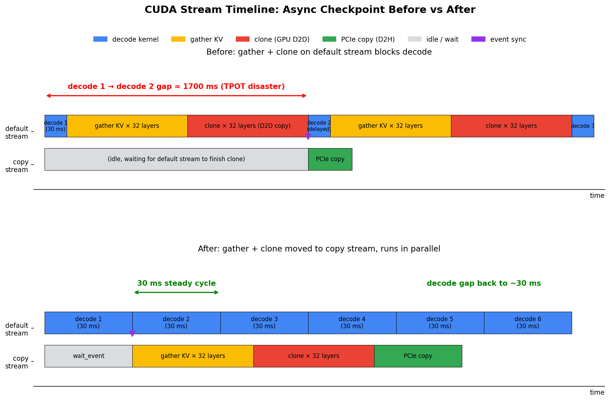

# Project Status Summary (2026-04-29)

## Starting Point

Our system was behind baselines on goodput. NoFT-Reprefill ran at 3.2 tokens/sec, ours at 2.5.

## What Worked

**Async checkpoint stream separation.** Moved KV cache GPU-to-host copy off the main forward stream. TPOT p95 dropped from 1219 ms to 189 ms. SLO violation rate dropped from 63 percent to 3.9 percent.

**Disabled prefix caching.** Methodology fix. Removed a small-prompt-pool confound from LongBench, following BanaServe and Splitwise.

**Removed redundant input validation.** Diagnostic code added 3 GPU syncs per forward. Removing it gave us +9 percent goodput. 

## Current State (W8 LongMix, Heavy load, F2_Mid fault, 3 seeds)

Goodput mean across seeds:

| System | Goodput |
|---|---|
| Vanilla (No-FT) | 3.23 |
| NoFT-Reprefill | 2.81 |
| Our-System | 3.10 |

We sit between vanilla and NoFT-Reprefill. Differences are within standard deviation (about 0.3 to 0.5).

Failover gap p95:

| System | Failover gap p95 |
|---|---|
| NoFT-Reprefill | 16.6 seconds |
| Our-System | 10.6 seconds |

Our system recovers 36 percent faster on this metric in the seed=42 case. The 3-seed sweep below shows this advantage is not consistent across loads.

## Overnight Matrix (3 seeds each, finished 2026-04-29 09:00)

We swept load and SLO to look for a regime where Our-System wins on goodput.

| Group | Load | SLO | Vanilla | NoFT-Reprefill | Our-System | gap p95 (Reprefill / Ours) |
|---|---|---|---|---|---|---|
| A | Moderate (0.4 RPS) | 5s/5s | 4.63 | 4.59 | **3.33** | 2642ms / 6123ms |
| B | Moderate (0.4 RPS) | 2s/2s | 1.14 | 1.04 | **0.93** | 2644ms / 1908ms |
| C | Light (0.2 RPS) | 5s/5s | 7.51 | 7.40 | **6.33** | 164ms / 3727ms |

In all three groups, Our-System loses on goodput. The earlier seed=42 failover gap advantage does not reproduce at 3-seed mean. Only group B (tight 2s SLO) keeps Our-System gap below NoFT-Reprefill, but everyone is failing SLO at that point.

The hypothesis that Moderate or Light load would let our FT mechanism shine has not been supported by data.

## Next Step

Rent a 4-machine cluster to run dp=4 and dp=8 experiments. At dp=2 the Benders solver mostly degenerates to greedy fallback. Higher dp is the most likely path to a clean signal.

Before renting we will work through this checklist locally to avoid wasting cloud time:

1. Smoke test FT code at dp greater than 2 (untested today).
2. Profile decode capacity on L40S.
3. Verify cross-host NCCL networking on the four local L40S machines.
4. Prepare deployment scripts for repo, virtualenv, and datasets.
5. Lock down the final experiment matrix.

The (load, SLO) sweep on A6000 is done (see Overnight Matrix above). dp scaling on rented L40S is the remaining open path.

## Risks

1. We have not found any (load, SLO) combination on W8 at dp=2 where Our-System beats NoFT-Reprefill on goodput. The avenue may simply not exist at this scale.
2. Failover gap p95 advantage is also not stable across seeds. The 36 percent advantage was a single-seed observation.
3. dp scaling is a hypothesis, not a measured fact. If dp=4 still shows our system within noise, this path closes.
4. We may need to switch workload (RULER 32K-128K) so re-prefill becomes physically infeasible, or switch metric (lead with conditional fault-recovery success rate instead of goodput).
