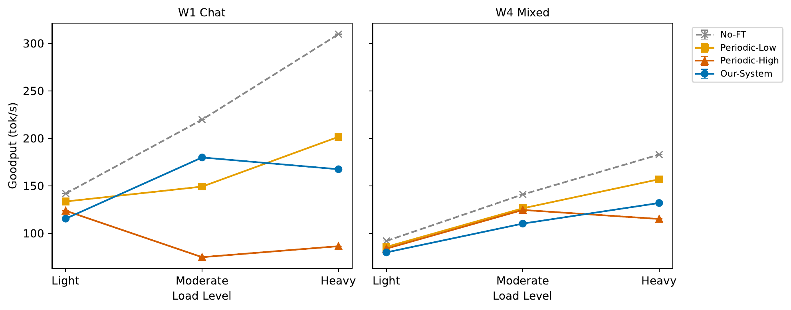
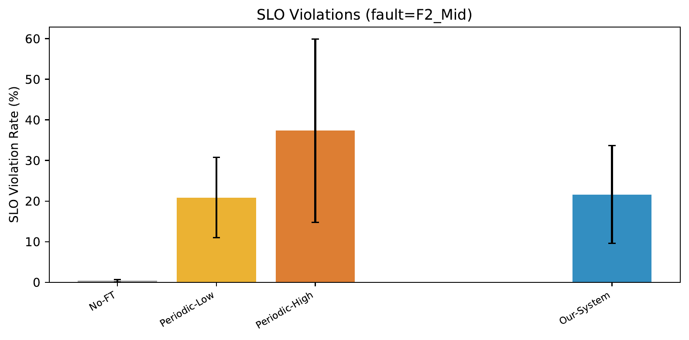
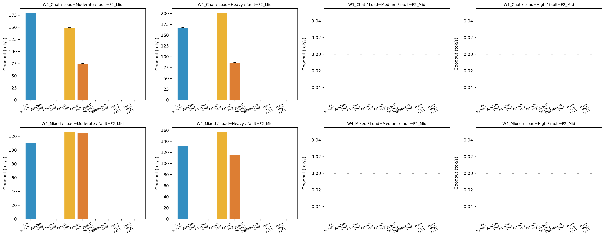

# Project Status & Direction Discussion

**Date**: 2026-04-22
**Purpose**: Present current experimental results, diagnose why we are not beating the baseline, and propose a path forward.

---

## 1. What Our System Does

Our system provides **fault-tolerant LLM serving** with two core mechanisms:

1. **Benders-based solver** for admission control: every 20 ms, jointly decides which incoming requests to accept and which replica to route them to. The solver **proactively reasons about all possible GPU failure scenarios**, ensuring that if any GPU fails, the surviving GPUs can still recover in-flight requests within the SLO.

2. **Adaptive checkpoint**: periodically saves KV cache from GPU to CPU host memory. When a failure occurs, in-flight requests can resume from the most recent checkpoint instead of re-running prefill.

**Baselines we compare against**:
- **No-FT (NR)**: vanilla vLLM, no fault tolerance, no checkpoint
- **Periodic-Low**: fixed checkpoint every 10 blocks
- **Periodic-High**: fixed checkpoint every 1 block
- **Our-System (V2)**: Benders routing + adaptive checkpoint

---

## 2. Experimental Results: We Are Losing to the Baseline

### 2.1 Goodput under Fault (F2_Mid) — W1_Chat

**Observation**: No-FT has the highest goodput across all load levels; Our-System trails, especially at Heavy load.

### 2.2 SLO Violation Rate under Fault

**Observation**: No-FT looks to have the lowest SLO violation, but this is partly because No-FT **silently drops** failed requests (doesn't count them). Periodic-High is the worst — showing that **more checkpointing is NOT better**.

### 2.3 Failover Gap (p95 Recovery Time)

**Observation**: Our-System achieves competitive recovery gap, but the normal-case overhead erases this benefit in overall goodput.

### 2.4 Our Strongest 9-seed Paired Comparison (W7_Saturated Heavy)

| Recovery | Checkpoint | Solver | Config | Strict wins vs NR (n=9) |
|---|---|---|---|---|
| reload | ✓ | ✓ | **V2-full** | **0 / 9** (−11% gp) |
| reprefill | ✓ | ✓ | V2-reprefill | 0 / 8 (−14% gp) |
| reprefill | ✗ | ✓ | **V2-NoCkpt** | 4 / 9 (−9.3% gp, not significant) |
| reprefill | ✗ | ✗ | NR (baseline) | reference |

**Critical finding**:
- **Every version with checkpoint enabled LOSES to NR**
- **Removing the checkpoint mechanism brings performance closest to NR**
- Paired t-test p ≈ 0.11, not statistically significant even for V2-NoCkpt

### 2.5 The Only Positive Result: W5 LongDoc Overload

On ArXiv long-document workload at Moderate load, V2-NoCkpt **protects completion rate**:

| seed | V2-NoCkpt completion | NR completion | Δ |
|---|---|---|---|
| 42 | 78% | 90% | −12 |
| 123 | 89% | 90% | −1 |
| 456 | **85%** | **24%** | **+61** |
| 789 | 84% | 84% | 0 |
| 1234 | 96% | 96% | 0 |
| 22222 | 100% | 88% | +12 |
| **mean** | **88.5%** | **78.6%** | **+9.9%** |

On the worst seed (s456), NR's FCFS queue collapses (24% completion); V2's admission control holds the line at 85%. This is our **only reliable positive claim**.

### 2.6 Ablation: Which Component Matters?

**Observation**: Adaptive checkpoint (alone) reaches parity with full Our-System; Benders routing alone underperforms significantly. **Routing is not contributing in our current dp=2 setup.**

### 2.7 Controller (Benders Solver) Overhead

**Observation**: Solver latency ~10-25 ms per epoch. Epoch fires every 20 ms. **The solver is running almost continuously on the API server main thread**, directly contending with decode scheduling.

### 2.8 Recovery Breakdown (E2)

**Observation**: Recovery latency is dominated by detection + re-prefill at 8B/A5000. Checkpoint reload savings are small relative to total recovery time.

---

## 3. Diagnosis: Why We Are Losing

Based on Liting's framework of "algorithm overhead failure modes", we diagnose our situation as follows:

### Mode 1: Algorithmic complexity too high?
**No.** Benders MIP with ~tens of variables solves in 5–15 ms. Not a complexity problem.

### Mode 2: Low complexity but high constant factor?
**Partially.** Snapshot building, cost table construction, dispatch — these add ~10–25 ms of pure Python work per epoch.

### Mode 3: Algorithm cheap but placed in the wrong location?
**Yes, partially.** Solver core runs in a background thread, but snapshot / dispatch / metadata updates all run on the API server main thread, contending with decode scheduling.

### Mode 4: Not algorithm but systems overhead (GIL, memcpy, sync)?
**Yes, partially.** cProfile shows the main thread is only 13% CPU utilized — it's waiting on GIL / async scheduling / RPC futures, not compute-bound.

### Mode 5: Algorithm is fine but the value proposition itself doesn't hold?
**This is the most critical diagnosis — YES.**

Evidence:
- V2-NoCkpt (checkpoint **removed**) beats V2-full
- Meaning: the checkpoint mechanism is **net negative** in current setting
- Even with oracle-level (zero-overhead) checkpoint, re-prefill at 8B/A5000 is only ~300 ms — the checkpoint reload (~200 ms) doesn't meaningfully save time
- **The value of "faster recovery via checkpoint" is near-zero at small model + short context**

Liting's framework says: if even oracle-level implementation can't win, the direction itself is wrong for this setting. **We are in Mode 5.**

### But Mode 5 is conditional on setting

The current setting (8B + A5000 + short prompt) makes re-prefill cheap. In a different setting:
- **Long context (32K+)**: re-prefill cost grows O(N²) via attention, potentially tens of seconds
- **Large model (70B+)**: per-token FLOPs much higher
- **Multi-GPU TP on PCIe**: re-prefill pays communication tax

In those settings, Mode 5 may not apply — the value proposition could be real. This is why our W5 LongDoc has a positive result while W7 Heavy loses.

**Conclusion**: We are in Mode 5 for the current setting, but this may not hold in different settings. We need a decisive experiment to validate.

---

## 4. Related Work Check

To see if our direction still has room given existing work:

### 4.1 Competitors in preemption-aware serving (all 2024-2025)

| Paper | What it does | Venue |
|---|---|---|
| vLLM RECOMPUTE/SWAP | Baseline preemption | SOSP'23 |
| FastServe | MLFQ + skip-join preemption | arXiv 2023 |
| Llumnix | Cross-instance live migration | OSDI'24 |
| Sarathi-Serve | Chunked prefill to avoid preemption | OSDI'24 |
| QLM | Global queue reorder + eviction | SoCC'24 |
| CacheOpt | Adaptive SWAP vs RECOMPUTE per request | arXiv'25 |
| JITServe | Cost-benefit preempt decision | arXiv'25 |
| QLLM | Layer-level preemption for MoE | EuroMLSys'25 |
| Medha | Deadline-aware scheduling | arXiv'24 |

**The preemption-aware scheduling space is crowded.** Any direction "smarter preempt policy" will face competition.

### 4.2 KV cache compression (Liting has mentioned)

| Paper | Approach | Venue |
|---|---|---|
| StreamingLLM | Sink tokens + recent window | ICLR'24 |
| H2O | Heavy-hitter eviction | NeurIPS'23 |
| Scissorhands | Pivotal tokens | NeurIPS'23 |
| SnapKV | Compression at specific layers | 2024 |
| Quest | Query-aware selection | 2024 |
| **SAGE-KV** | **Joint token × head top-k** | arXiv'25 |
| Ada-KV | Per-head token budget | NeurIPS'25 |
| RazorAttention | Head-type classification | ICLR'25 |
| DuoAttention | Head-type (full/streaming) | ICLR'25 |

**The "2D token × head" selection space is also crowded.** SAGE-KV literally does "joint top-k over tokens × heads" — exactly the combination we might want.

Pure "sparse KV + checkpoint" without a third angle would overlap with these papers.

---

## 5. Options Going Forward

### Option A: Cut Benders, refocus, target SoCC 2026 (July deadline)

**What changes**:
- Drop Benders solver (reclaim main-thread headroom)
- Change admission to simple SLO-check rules
- Reframe: **"per-request adaptive KV preservation for long-running LLM inference"**
- Focus on runtime events (OOM / process crash / preemption), not rare GPU faults
- Main workload: W5 LongDoc (where we already have +9.9% completion gain)

**Estimated effort**: 9–12 weeks
**Estimated SoCC acceptance rate**: ~25–35%
**Main risk**: differentiation from FastServe / QLM / CacheOpt / QLLM

### Option B: Add sparse KV integration, target EuroSys'27 fall

**What changes**:
- Option A + integrate sparsity-based compression into checkpoint
- **Requires a third differentiation angle** (e.g., SLO-aware sparse budget) since pure "temporal × importance" is taken by SAGE-KV
- Must evaluate accuracy loss from sparse checkpoint

**Estimated effort**: 4–5 months
**Estimated acceptance rate**: ~25–35% (novelty higher but competition stronger)
**Main risk**: differentiation from SAGE-KV / Ada-KV / RazorAttention

### Option C: Narrow scope, target SoCC with focused paper

**What changes**:
- Abandon fault tolerance framing entirely
- Focus on W5 LongDoc overload +9.9% completion as the single claim
- Position as "**admission control for overload protection in long-context serving**"

**Estimated effort**: 6–8 weeks (most current data usable)
**Estimated acceptance rate**: ~20–30% (narrow scope may draw criticism)
**Main risk**: paper contribution feels thin

---

## 6. Next Step: Phase 0 Validation (1–2 Days)

Before committing to any option, we propose a **minimal-cost validation experiment** to test whether Mode 5 holds across settings:

**Setup**: L40S + Llama-3.1-8B with max_model_len=32K (or larger with 30B FP8)

**Test**: Measure re-prefill time at varying context lengths (8K, 16K, 32K, 64K)

**Decision criterion**:
- If re-prefill at 32K+ takes > 5s on L40S → value proposition for checkpoint reload **may still hold in long-context setting**, continue Option A
- If re-prefill stays fast (< 2s) → Mode 5 applies broadly, **serious reconsideration needed**

This is an oracle-level test (no real fault injection needed) — we just need to measure re-prefill cost itself. 1–2 days of work.

---

## 7. Questions for You

1. **Should we cut Benders?** Data suggests yes. Any reason to salvage it?

2. **Sparse KV direction**: The 2D temporal × importance space is already occupied by SAGE-KV (2025). A viable direction would require a third angle (e.g., SLO-aware sparse budget), pushing timeline to EuroSys'27 fall or later. Is this worth pursuing?

3. **Hardware budget**: Current A5000 dp=2 may be fundamentally too small for our value proposition. Can we secure L40S access for extended experiments with 30B or longer context?

4. **Venue target**: SoCC July or EuroSys'27 fall? Different scopes.

5. **Negative-result paper acceptability**: If further experiments confirm Mode 5 broadly, would an honest "we evaluated the design space and found FT overhead dominates at this scale" paper be acceptable? Workshop / short-paper venue only.

---

## 8. My Recommendation

**Option A (cut Benders, reframe to adaptive KV preservation, target SoCC)** — provided Phase 0 validation shows re-prefill cost grows meaningfully with context length.

Reasoning:
- Highest code reuse (~60–70%)
- Clearest story post-reframing
- Avoids 2D sparse KV overlap with SAGE-KV etc.
- SoCC timeline is achievable (9–12 weeks)

If Phase 0 shows no improvement in long context → we are in Mode 5 fundamentally, and we should discuss Liting's suggestion of pivoting LLM-specific dimension or considering the Junchen project.

---

## Appendix: Reference Documents

- `experiments_v2/docs/overnight_2026-04-21_summary.md` — 2-day investigation log
- `experiments_v2/docs/paper_claim_v3_2026-04-21.md` — honest retraction of original claim
- `experiments_v2/docs/investigation_summary_2026-04-08-09.md` — detailed bug-fix and Phase 6-17 optimization records
- `experiments_v2/docs/motivation_runtime_failure_preservation.md` — proposed new framing (runtime events, not just GPU fault)
- `experiments_v2/docs/adaptive_checkpoint_analysis.md` — formula-level analysis of adaptive checkpoint economic model
