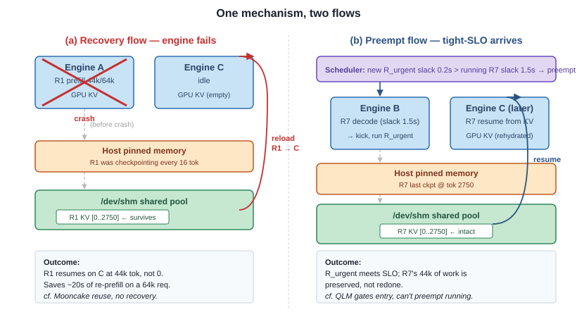
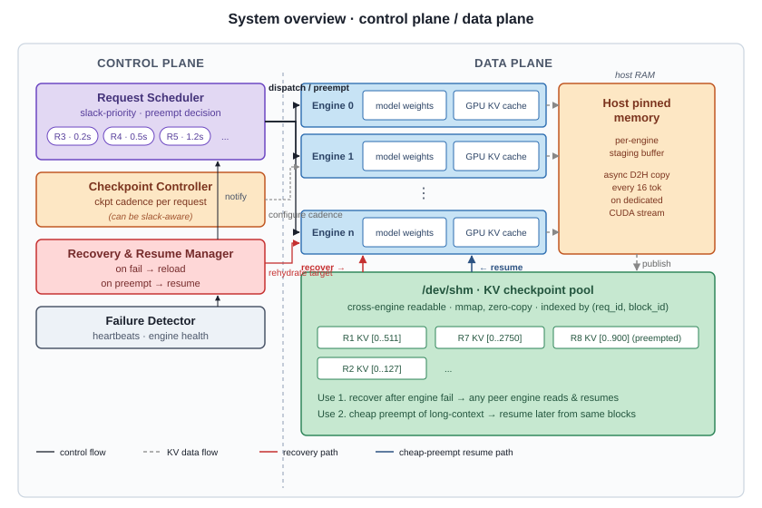

# 2026-05-13

Cheap Preemption Enables Disruption-Aware SLO Scheduling for Long-Context LLM Serving — APSys 2026 Workshop, ddl May 20 (Wednesday).

---

## 1. Motivation

### 1.1 Two scenarios that burn the prefill

| | Scenario A — Engine failure | Scenario B — Priority preempt |
|---|---|---|
| Trigger | GPU disappears mid-decode (HW fault · OOM · drain · kill · multi-tenant preempt) | Tight-SLO request arrives with deadline tighter than running request's |
| Exposure | Long requests overexposed (lifetime ∝ disruption probability) | Routine under any non-uniform workload |
| Today's outcome | Full reprefill on a surviving engine (tens of s at 16K) | Scheduler refuses to preempt long-context decode — tight req waits / misses |

**Root cause:** no cheap way to *resume* a partial decode.

---

## 2. Key insight

> One mechanism. Two uses.

A single **host-side KV checkpoint**, async-published to a shared host store at block-aligned cadence, backs both **(i)** recovery when an engine dies and **(ii)** cheap preempt of running long-context decode.



---

## 3. Design

### 3.1 Architecture



### 3.2 Mechanism — host-side KV checkpoint

| Aspect | Decision |
|---|---|
| What gets saved | Per-block delta — newly-stable blocks since last save |
| When | Every 16 tokens decoded (= one vLLM KV block); block alignment mandatory |
| Where | L1 pinned host pool + L2 shared host mirror |

**Engine-death gap.** Save path advances `num_checkpointed_tokens` eagerly, so the counter can run ahead of what actually landed in the shared store. Peer reads the older "latest" and silently restores fewer tokens; reload state machine absorbs the gap as decode replay.

**Healthy-load tax.** +~30 ms TTFT P50 vs no-FT baseline; throughput within 0.5%.

### 3.3 Policy — slack-based preempt picker

**Slack** = wall-clock remaining before request misses its SLO.

| Stage | Formula |
|---|---|
| Pre-first-token | `slack = S_TTFT − elapsed_since_arrival` |
| Post-first-token | `slack = S_TPOT − avg_per_token_so_far` |

**Picker rule.** Every scheduler step:
- `victim ← argmax slack` over running queue (most relaxed)
- `head ← argmin slack` over waiting queue (most urgent)
- Preempt iff:
  ```
  slack(victim) − slack(head)  >  δ + replay_cost(victim)
  AND  num_checkpointed_tokens(victim) > 0
  AND  time_since_last_preempt(victim) > cooldown
  ```
  where `replay_cost = extra TPOT × tokens new engine recomputes`.

**Three guards.**

| Guard | Kills |
|---|---|
| Hysteresis `δ` | Thrashing on similar-slack pairs |
| `replay_cost` | Unfavorable trades (net slack must improve) |
| `cooldown` | Repeat-victim — same request preempted every step |

**Defaults.** `δ = 1 s`, `cooldown = 5 s`.

### 3.4 Cross-engine reroute


- **Detect.** Engine writes heartbeat to shared status file every 200 ms (daemon thread, NOT `step()`). Router polls every 500 ms; > 2 s stale ⇒ dead.
- **Reroute.** Router re-forwards in-flight requests with `is_rerouted=True` + original `internal_req_id` + published `num_checkpointed_tokens`.
- **Restore.** New engine reloads KV from shared store → flips to `PREEMPTED` → vLLM's resumed-from-preempt admit path takes over. No admit-loop change.

---

## 4. Evaluation

### 4.1 Setup

| Item | Value |
|---|---|
| Hardware | 2× NVIDIA A6000 PCIe (48 GB each) · portability check on 2× L40S |
| Model | Qwen2.5-7B-Instruct fp16, `max_model_len 32K` |
| Workloads | RULER 16K (long-context regime we target) + ShareGPT (short-context — must not break) |
| Arrivals | Poisson · Niyama-style 3-tier QoS (tight / normal / loose) in main figure |
| SLO calibration | Baseline P95 on `vllm_fcfs` at uncontested low QPS (RULER 0.02, ShareGPT 0.1). Tiers = baseline × {2×, 3×, 6×} for tight / normal / loose (tight changed 1.5× → 2× on 2026-05-13: 1.5× too tight on ShareGPT under natural batch-size jitter) |
| Seeds | 3 per config; mean ± std reported |

**Baselines — 4-way comparison to isolate router cost, FT cost, picker contribution.**

| Baseline | What's on |
|---|---|
| `vllm_fcfs` | No router, no FT — floor |
| `reroute_no_ckpt` | Router on, FT off — isolates router cost |
| `ours_no_picker` | FT mechanism on, slack picker off — ablation |
| `ours` | Full system |

### 4.2 Three experiments

| Experiment | What it measures | Claim | Status |
|---|---|---|---|
| **E_M1** main figure | SLO attainment vs QPS on RULER 16K + ShareGPT | `ours` holds attainment past saturation knee where baselines drop below 90%. Long-context gap clearest. | A6000 1.0–8.0 QPS sweep × 3 seeds in. L40S replicate in progress. |
| **E_M4** picker ablation | Same axes + `ours_no_picker` | `ours_no_picker` sits between `ours` and `reroute_no_ckpt`. Mechanism alone = passive benefit; picker = active SLO advantage. | `ours_no_picker` runs scheduled this week. |
| **E_D1** failover gap | SIGKILL → next-token latency vs context length, three systems | `ours` ≈ 1.5 s on RULER 16K. `no_ckpt` ≈ 10–20 s at 16K. Gap *grows with context length* (tens of s extrapolated at 64K). Lower variance too (single V3 batch sync). | RULER 16K demo working. Scaling to longer context next. |

**Healthy low-QPS de-risk.** `ours` adds ~30 ms TTFT P50 over `reroute_no_ckpt`, throughput within 0.5%. `vllm_fcfs ≈ reroute_no_ckpt` — router itself essentially free.

---

## 5. Status

- [x] Paper framework drafted
- [~] E_M1 — A6000 sweep × 3 seeds in; L40S replicate in progress
- [~] E_M4 — `ours_no_picker` runs scheduled this week
- [~] E_D1 — RULER 16K demo working; scaling to longer context
