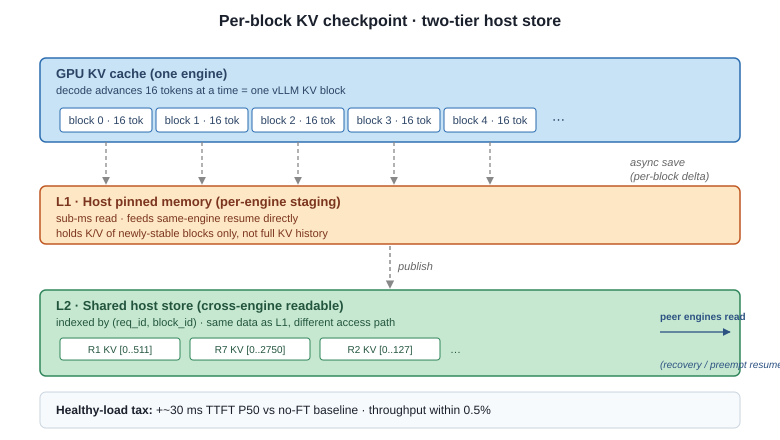

# 2026-05-13

## Idea

- **老 idea**：host-side KV checkpoint 做 fault tolerance —— engine 死了能从 checkpoint 恢复。问题是 failure 概率太低，实际效果不够好。
- **新 idea**：利用 KV checkpoint 机制让 preempt 变便宜，scheduler 因此能更好地满足 SLO、提升整体 goodput。**复用老 idea 里"不重新 prefill 就能 resume"的那部分**，其余设计（slack-based preempt policy）是新的。

## Design

### KV checkpoint mechanism

| | |
|---|---|
| What | per-block delta（只存新稳定的 block） |
| When | 每 16 token 一存（一个 vLLM KV block） |
| Where | L1 host pinned（同 engine）+ L2 shared host store（跨 engine 可读） |

正常负载下开销很小：TTFT P50 大约多 30 ms，throughput 差距在 0.5% 以内。

### Slack-based preempt picker

- **slack** = 离 SLO miss 的 wall-clock 时间
- 每个 scheduler step：running 队列里挑 slack 最大的 (victim)，waiting 队列里挑 slack 最小的 (head)
- preempt 条件（三个 AND）：`gap > δ + replay_cost` · `victim 有 checkpoint` · `cooldown 过了`

## Method

### Setup

| | |
|---|---|
| Hardware | 2× A6000（+ L40S portability） |
| Model | Qwen2.5-7B-Instruct fp16, `max_model_len 32K` |
| Workloads | RULER 16K（主打）· ShareGPT（don't break） |
| Arrivals | Poisson · 3-tier QoS（tight / normal / loose） |
| SLO tiers | baseline P95 × {2×, 3×, 6×} |
| Baselines | `vllm_fcfs` · `reroute_no_ckpt` · `ours_no_picker` · `ours` |
| Seeds | 3 per config |

### Experiments

| | Measures | Status |
|---|---|---|
| **E_M1** | SLO attainment vs QPS | A6000 done · L40S 在跑 |
| **E_M4** | picker ablation（+ `ours_no_picker`） | 这周排上 |
| **E_D1** | failover gap（FT use case，bonus） | RULER 16K demo 跑通 |

## Submission

- **目标**：APSys 2026 Workshop
- **DDL**：5/20（周三）
