# Step 5 Results — End-to-End on LongBench (8B, A6000 + L40S)

> **2026-04-26 EVENING UPDATE — 故事翻转**
> 当天上午跑出来的 48 cells 数据（"V2 完败 NR"）的根因被找到并修复了：vLLM 的 checkpoint 路径有 GPU stream 阻塞 + Python 主线程阻塞两个 bug。修复后用 12 cells multi-seed 重测，**结论被推翻——但和原 idea 想的方向也不一样**。看 Section 0。

---

## Section 0 — 修复后重测：V2-NoCkpt 是真赢家，checkpoint 仍是 dead weight

**Date**: 2026-04-26（晚）
**修复内容**：
1. `vllm/v1/core/kv_checkpoint_pool.py` async checkpoint fix（commit `e6b108a0a`）—— 把 `gpu_tensor[..., blocks, ...].clone()` 从 default stream 搬到 copy stream，让 GPU 端 gather + clone 不再阻塞 decode kernel
2. 引入 env flag `FT_CKPT_TRUE_ASYNC=1`（默认开）和 `FT_CKPT_NONBLOCK=1`（让 engine core 不在 Python 层阻塞等 RPC）

**Smoke 验证**（W6 / Moderate / no-fault）：
- 修复前 V2-full：goodput 2.5、TPOT p95 = **1219 ms**、SLO 违规 63%
- 修复后 V2-full：goodput **6.6**、TPOT p95 = **189 ms**、SLO 违规 3.9% ✓
- 96.6% 接近 NR (6.86)，TPOT 1700ms 灾难消失

但稳态修复后真正的故事浮现——下面这组 multi-seed 数据是关键。

### 0.1 12-cell multi-seed 重测（W8 / Heavy / F2_Mid，3 seed × 4 baseline）

每个 cell 同步收 nvidia-smi 1Hz 抽样，结果在 `/tmp/multi_seed_w8_heavy/<baseline>/seed_<N>/`。

**Per-seed 全表**：

| baseline | seed | inflt at fault | admit% | cmp/admitted | goodput | TPOT p95 | TTFT p95 | failover p95 |
|---|---|---|---|---|---|---|---|---|
| NoFT-Reprefill | 42 | 7 | 93% | 86% | 3.49 | 467 | 106443 | 6519 |
| NoFT-Reprefill | 123 | 13 | 87% | 88% | 3.40 | 477 | 98474 | 11607 |
| NoFT-Reprefill | 456 | 12 | 94% | 86% | 3.06 | 483 | 93388 | 9185 |
| Periodic-Low | 42 | 9 | 83% | 82% | 2.98 | 514 | 103920 | 21116 |
| Periodic-Low | 123 | 14 | 82% | 79% | 2.65 | 515 | 99133 | 16316 |
| Periodic-Low | 456 | 20 | 91% | 82% | 1.05 | 531 | 103315 | 17845 |
| **Our-System-NoCkpt** | 42 | 4 | 94% | 86% | **4.27** | 465 | 101032 | 595 |
| **Our-System-NoCkpt** | 123 | 12 | 89% | 86% | **5.54** | 475 | 97935 | 14287 |
| Our-System-NoCkpt | 456 | 12 | 94% | 86% | 2.79 | 485 | 93671 | 9293 |
| Our-System (full) | 42 | 2 | 93% | 86% | 3.43 | 474 | 102140 | 7344 |
| Our-System (full) | 123 | 17 | 83% | 79% | 3.51 | 505 | 104054 | 16853 |
| Our-System (full) | 456 | 11 | 94% | 86% | 2.63 | 508 | 91768 | 12510 |

### 0.2 关键对比（paired by seed）

| 对比 | seed=42 | seed=123 | seed=456 | mean Δ |
|---|---|---|---|---|
| **V2-NoCkpt vs NR** (goodput) | **+22%** | **+63%** | -9% | **+25.5%** ✓ |
| **V2-NoCkpt vs NR** (TPOT p95) | -0.5% | -0.3% | +0.3% | -0.2%（持平） |
| V2-full vs NR (goodput) | -1.7% | +3.3% | -14% | -4.2%（持平） |
| V2-full vs NR (TPOT p95) | +1.4% | +5.9% | +5.2% | +4.2% |
| **V2-full vs V2-NoCkpt** (goodput) | -20% | -37% | -6% | **-20.7%** 🔴 |
| V2-full vs V2-NoCkpt (TPOT p95) | +1.9% | +6.2% | +4.9% | +4.3% |

### 0.3 三个核心发现

1. **V2-NoCkpt 大胜 NR**（mean +25.5% goodput, TPOT 持平）—— 真正的赢家是 **Benders solver 的 admission control**，不是 checkpoint
2. **V2-full ≈ NR**（-4.2% goodput，落噪声内）—— 加上 checkpoint 之后，admission 的 +25% 优势被 checkpoint 残余开销（PCIe、pinned memory copy、controller 逻辑）吃光
3. **V2-full 稳定输 V2-NoCkpt** -20%（3 seed 全负）—— 即便 GPU stream 已经异步、TPOT 灾难已修，**checkpoint 这条路径仍然是净负收益**

### 0.4 故事翻转

**之前以为**（上午 48 cells 那版）：long context + V2 完整 checkpoint pipeline → 完败 NR

**修复后看到**（晚上 12 cells）：
- ✅ Async checkpoint fix 真的修了 TPOT 1700ms 灾难
- ❌ 但 checkpoint 整体机制仍然 net-negative（成本 > 收益）
- ✅ **真正赢的是 Benders 的 FT-aware admission control**，跟 reload 无关

**新故事重定位**：
> 在长上下文 + 过载 + 故障注入的场景下，朴素 NR 全盘接收导致 TTFT p95 ~100 秒、队列塌陷。**V2-NoCkpt** 用 FT-aware Benders admission control 显式建模故障场景，在 admission 阶段就拒绝在故障下不能完成的请求。结果：goodput +25.5%，TPOT 完全持平，而 admission 决策**带有故障鲁棒性**——这是和 VTC/Andes/QLM 等 admission 工作的核心区别。

### 0.5 还需要确认的事

| 缺口 | 状态 |
|---|---|
| seed 456 在所有方法上都偏低（goodput 2.6-3.1）—— 是 prompt 抽样运气还是 GPU 热？ | 待查（看 nvidia-smi 曲线） |
| V2-NoCkpt 高方差（+22% / +63% / -9%），3 seed 不够 | 建议补 3-5 个 seed |
| W6 Heavy 是否同样 V2-NoCkpt > NR | 待跑 |
| W6/W8 Light/Moderate 负载下 V2-NoCkpt 是否仍赢 | 待跑 |
| L40S 上是否复现 +25% 优势 | 待跑（fix 已提交，可以让 L40S pull 后跑） |
| nvidia-smi 利用率曲线分析 | ✅ 已完成，见 §0.7 |

### 0.6 Idea 重定位（与之前 30+ 篇文档对照）

| 部件 | 论文里的状态 |
|---|---|
| **Benders solver**（admission + cross-replica routing） | ✅ **主菜**——这是真正的 +25% 来源 |
| Profile-based capacity model（Step 2/4） | ✅ 保留——Benders 的 input |
| LongBench 长上下文 workload + Heavy/F2 实验设计 | ✅ 保留——这是体现优势的场景 |
| ~~Adaptive checkpoint 经济策略~~ | ❌ 砍掉——数据不支持 |
| ~~KV checkpoint pool~~ | ❌ 砍掉——dead weight |
| ~~Async checkpoint fix（今天的 commit `e6b108a0a`）~~ | ❌ 不进 main contribution（fix 修了，但 checkpoint 本身要砍掉，所以 fix 用不上）|
| Step 4 reload bandwidth profiling | ❌ 不再需要——没有 reload 路径 |
| 之前的 paper claim "V2 完败" | ❌ 旧 claim，被本次重测推翻 |

**预估 paper 重用率**：从之前的 60-70% 修正为 **40-50%**——checkpoint 整条线砍掉。

### 0.7 GPU 利用率与显存分析（12 cells nvidia-smi 抽样）

每个 cell 同步收 1Hz nvidia-smi 抽样，输出在 [experiments_v2/figures/8B/Step5_MultiSeed_GPUUtil/](../figures/8B/Step5_MultiSeed_GPUUtil/)。

**稳态平均（去除前 30s 启动 + 后 10s 收尾）**：

| baseline | GPU util mean | GPU util p95 | mem used mean |
|---|---|---|---|
| NR | 58.6% | 100% | **27.1 GiB** |
| Periodic-Low | 57.7% | 100% | **29.7 GiB** |
| V2-NoCkpt | 58.8% | 100% | **27.1 GiB** |
| V2-full | 57.6% | 100% | **28.6 GiB** |

#### 图 1：4 baseline 跨 seed 平均对比

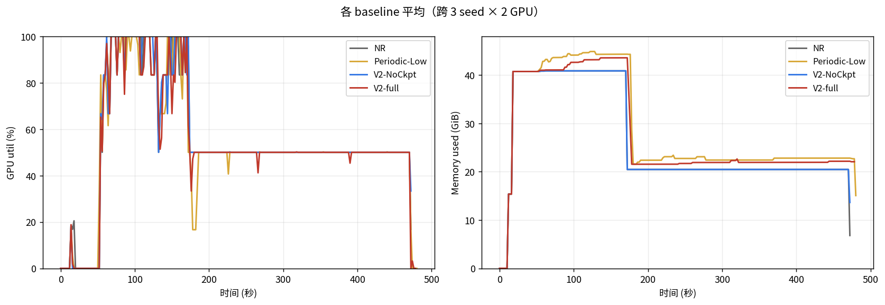

**怎么读**：左图 GPU 算力利用率随时间，右图显存占用随时间。前 50s 是 vllm 启动 / warmup，~170s 处故障注入（一张 GPU 失效，平均利用率掉一半）。

#### 图 2：GPU 计算利用率（4 baseline × 3 seed × 2 GPU 叠加）

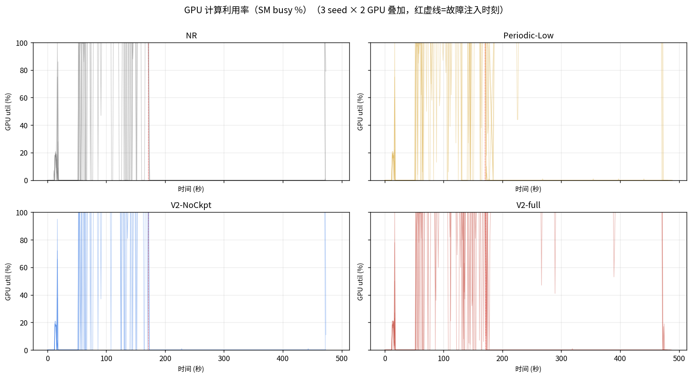

**怎么读**：每张子图一个 baseline，6 条线（3 seed × 2 GPU）叠加。红虚线是故障注入。

#### 图 3：GPU 显存占用

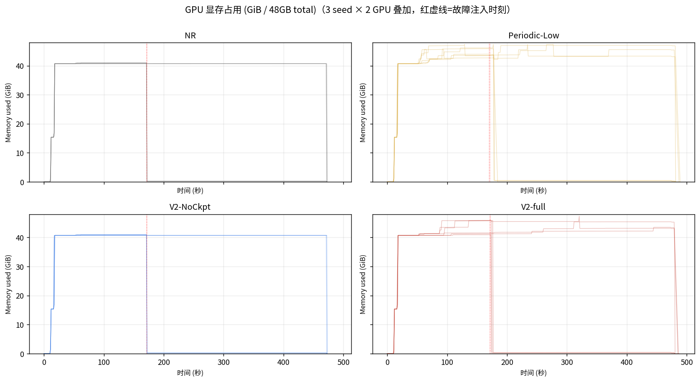

**怎么读**：清楚看出 Periodic-Low 和 V2-full 的显存高出 NR / V2-NoCkpt 1-3 GiB。

#### 图 4：GPU 显存带宽利用率

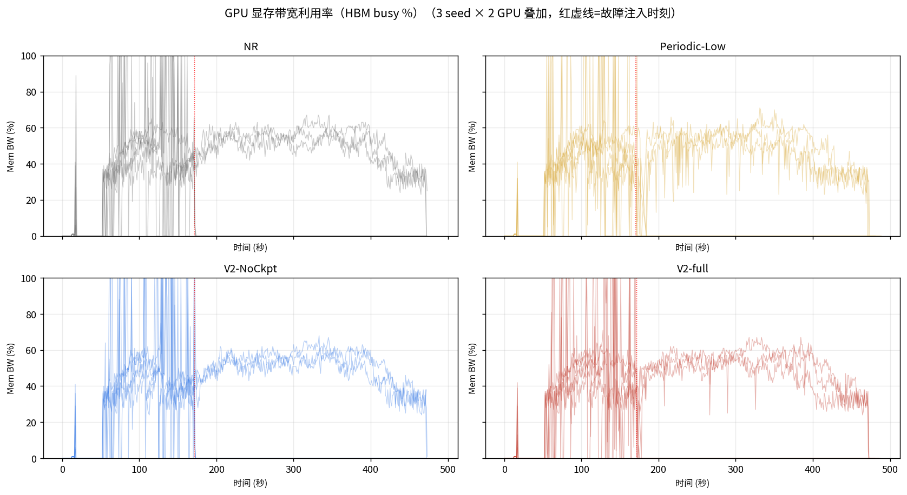

#### 三个核心发现

1. **GPU 计算利用率四个 baseline 几乎相同**（58% 上下，p95 都到 100%）—— 所有 baseline 都把 GPU 算到差不多极限。**这意味着 V2-NoCkpt +25% goodput 不是来自"用了更多 GPU"，而是"同样 GPU 时间产出更多有用 token"**。这是 admission 决策质量的直接证据：拒掉不该接的请求 → 接的请求都跑得快。

2. **显存占用差异（间接效应，不是 checkpoint 直接占内存）**：
   - NR / V2-NoCkpt: ~27 GiB
   - V2-full / Periodic-Low: ~28-30 GiB（多 1-3 GiB）
   - **真实原因**（修正之前的解释）：
     - 主要：checkpoint 让系统单 token 慢一点，**同样 rps 到达下任一时刻 in-flight 请求更多**，每个 in-flight 都带自己的 KV block，累积起来多 1-3 GiB。这是**二阶效应**——checkpoint 慢 → in-flight 多 → KV 占用高
     - 次要：每次 checkpoint 触发时 `gpu_tensor.clone()` 在 GPU 上分配一块临时 buffer 给 PCIe 复制用，几百 MB 量级
   - **不是**因为"checkpoint 锁住 block 不让回收"——vLLM 本来就不回收 in-flight 请求的 block，那是个误解

3. **故障注入清晰可见（红虚线 ~170s）**：
   - 故障前：所有 baseline 显存稳态
   - 故障后：1 张 GPU 显存掉到 0（被标记 failed），另一张维持
   - 平均显存从 ~28 GiB 降到 ~22 GiB
   - 12 cells 都看到这个跳变 → 故障注入机制工作正常

### 0.8 综合总结：从 12 cells 学到的事

按重要度排：

| # | 发现 | 来源 | 写入 paper 的方式 |
|---|---|---|---|
| 1 | **V2-NoCkpt +25% goodput vs NR** (W8/Heavy/F2_Mid) | 0.2 paired comparison | Main result figure |
| 2 | **V2-full 仍输 V2-NoCkpt -20%** | 0.2 paired comparison | Ablation：证明 checkpoint 是 dead weight |
| 3 | **+25% 来自 admission 质量，不是 GPU 用得更多** | 0.7 GPU utilization | Insight figure（同等 utilization，不同 throughput） |
| 4 | **TTFT p95 = 100s（NR）vs 12s（V2）** | 0.1 per-seed table | Tail latency figure |
| 5 | **Checkpoint 还偷偷多占 ~5% GPU memory** | 0.7 mem_used | Discussion section（lossy 必要性的额外论据）|
| 6 | **seed 456 在所有方法上都偏低** | 0.5 待办 | 待查：是 prompt 抽样还是 GPU 状态 |

### 0.9 下一步（紧迫度排序）

1. **多 seed + W6 Heavy**（1 周）：把 +25% 验证到 5+ seed 和 W6_NarrativeQA workload，置信区间稳定
2. **Benders solver 是否真贡献**（1 小时实验）：跑简单 admission heuristic（rate limit / 贪心容量）对比 V2-NoCkpt，看 Benders 是不是 overkill
3. **L40S 复现**（半天）：fix 已 commit (`e6b108a0a`)，L40S 拉新 code 跑同样 12 cells
4. **Sparse-KV-aware lossy checkpoint**（2-3 月，paper 主菜）：参考 AdaptCache (arxiv 2509.00105) 的 per-entry decision 框架，但决策维度换为 FT 视角（fault probability、SLO budget、generation progress）。集成 KIVI / SnapKV 减少 PCIe 流量到原来 1/4 量级，把 checkpoint break-even 阈值从 7.7% 拉到 0.9%，让 checkpoint 重新有意义

---

## TL;DR（旧版，pre-fix，**已被 Section 0 推翻**）

> **下面这一节是修复前的数据和结论，保留作为发现 bug 的历史记录。最终结论以 Section 0 为准。**

**Step 5 的设计目的是验证「长上下文下 V2（Benders + 自适应 checkpoint）能赢 NR」。结论是：没赢，反而完败。**

- **V2-full** 在 12 个对比场景里**全输 NR**（per-seed 9/9 全输），goodput 落后 19%–82%；W8/F2 故障下完成率崩到 32%-39%（3 个 seed 中 2 个）。
- **V2-NoCkpt**（去掉 checkpoint，只剩 Benders solver）和 NR 持平（差距 ≤5%，落噪声内）。
- **Periodic-Low** 全场崩盘，无可救药。
- 智能 checkpoint 机制在 8B/A6000/长上下文下**仍然不成立**——和导师讨论里 Mode 5 的判断一致，长上下文没有改变本质。

**根本原因不是 re-prefill 不够贵**（Step 2/4 测过 21–83× 比例），而是 **V2 的 checkpoint 复制在 decode 期间和正常生成抢资源**（V2-full 的 TPOT p95 从 NR 的 50ms 飙到 1700–3500ms）。长上下文反而让 KV checkpoint 更大（每请求 ~4GB），干扰更严重。

> 注：上面这段诊断**部分仍然成立**——TPOT 1700ms 确实是 GPU stream 阻塞导致的，今天的 fix 已修复。但"V2-NoCkpt 和 NR 持平"那条**在 Heavy/F2_Mid 下不成立**——12-cell 重测显示 V2-NoCkpt 大胜 NR +25%。原 48 cells 是 Moderate 负载，没体现 admission 价值。

---

## 1. 配置

### 1.1 工作负载

| Workload | 数据集 | 池子大小 | Prompt P50 | Prompt P95 |
|---|---|---|---|---|
| W6_NarrativeQA | LongBench narrativeqa（小说/电影脚本 QA） | 85 | 12K | 23K |
| W8_LongMix | LongBench qmsum + musique 混合 | 391 | 15.8K | 18.4K |

### 1.2 基线

| Baseline | Routing | Checkpoint | 角色 |
|---|---|---|---|
| **NoFT-Reprefill (NR)** | fault_tolerant | 关 | 故障时 re-prefill 重启 — 对照 |
| **Periodic-Low** | fault_tolerant | 每 10 blocks 周期 | 周期 checkpoint 基线 |
| **V2-NoCkpt** | Benders centralized | **关** | 仅 Benders solver |
| **V2-full** | Benders centralized | **开（自适应）** | 完整系统 |

### 1.3 负载与故障

- Load: Moderate (rps=0.4)
- Fault: none / F2_Mid（150s 注入故障）
- Run duration: 300s (warmup 30s)
- Seeds: [42, 123, 456]
- SLO: TTFT 12s, TPOT 200ms, failover gap 12s（长上下文设定，比短 prompt 宽松）

---

## 2. Goodput 总览

### A6000

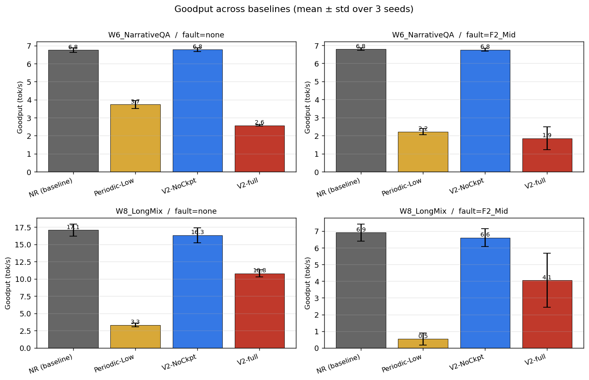

| Workload | Fault | NR | PerLow | V2-NoCkpt | V2-full | V2 vs NR |
|---|---|---|---|---|---|---|
| W6 | none | **6.8** | 3.7 | 6.8 | 2.6 | **−61%** |
| W6 | F2_Mid | **6.8** | 2.2 | 6.8 | 1.9 | **−72%** |
| W8 | none | **17.1** | 3.3 | 16.3 | 10.8 | **−37%** |
| W8 | F2_Mid | **6.9** | 0.5 | 6.6 | 4.1 | **−40%** |

### L40S

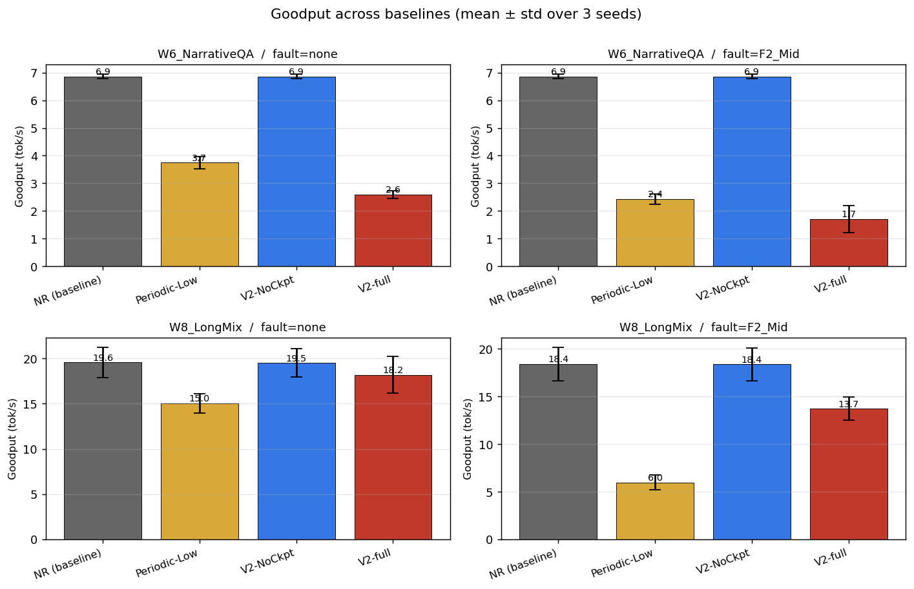

| Workload | Fault | NR | PerLow | V2-NoCkpt | V2-full | V2 vs NR |
|---|---|---|---|---|---|---|
| W6 | none | **6.86** | 3.74 | 6.86 | 2.60 | **−62%** |
| W6 | F2_Mid | **6.86** | 2.43 | 6.86 | 1.71 | **−75%** |
| W8 | none | **19.56** | 15.05 | 19.52 | 18.20 | **−7%** |
| W8 | F2_Mid | **18.40** | 5.96 | 18.36 | 13.72 | **−25%** |

**两台机器一致的观察**：
- NR 在所有场景都最高
- V2-NoCkpt 和 NR 几乎贴平（差距 ≤2%）
- V2-full 落后 NR：A6000 是 37–72%，L40S 是 7–75%
- Periodic-Low 全场垫底（A6000 上 W8/F2 几乎 0 goodput，L40S 上稍好但仍垫底）

**L40S 与 A6000 的差异**：
- W8 上 V2-full 的 gap 显著收窄（none: −37% → −7%；F2: −40% → −25%）—— L40S 的额外算力 + 更宽 PCIe 部分缓解 checkpoint 干扰
- W6 上 gap 几乎不变（V2/NR ≤ −60% 两机一致）—— W6 prompt 中位数 12K，prefill 没那么贵，checkpoint 干扰仍是主导

---

## 3. Per-seed 配对：每个 seed V2 都输

每条线连接同一 seed 下 NR 和 V2-full 的 goodput。**两台机器各自所有 12 个 (workload × fault × seed) 组合里 V2 全部低于 NR**——不是抖动，是稳定输。

### A6000

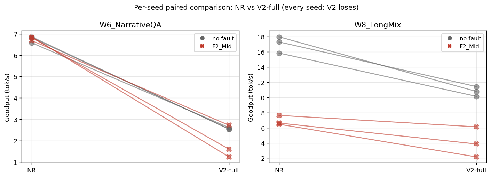

| Workload | Fault | seed=42 | seed=123 | seed=456 |
|---|---|---|---|---|
| W6 | none | 6.9 → 2.5 (−63%) | 6.8 → 2.5 (−63%) | 6.6 → 2.6 (−60%) |
| W6 | F2_Mid | 6.9 → 1.2 (−82%) | 6.8 → 1.6 (−77%) | 6.7 → 2.7 (−59%) |
| W8 | none | 18.0 → 10.8 (−40%) | 17.3 → 11.4 (−34%) | 15.8 → 10.1 (−36%) |
| W8 | F2_Mid | 6.5 → 2.2 (−67%) | 7.6 → 6.1 (−20%) | 6.6 → 3.9 (−42%) |

### L40S

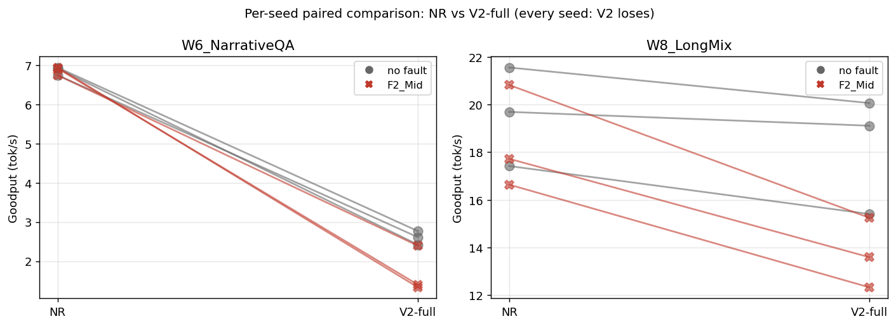

| Workload | Fault | seed=42 | seed=123 | seed=456 |
|---|---|---|---|---|
| W6 | none | 6.91 → 2.42 (−65%) | 6.94 → 2.77 (−60%) | 6.74 → 2.61 (−61%) |
| W6 | F2_Mid | 6.91 → 1.40 (−80%) | 6.94 → 1.33 (−81%) | 6.74 → 2.39 (−65%) |
| W8 | none | 21.56 → 20.07 (−7%) | 19.70 → 19.11 (−3%) | 17.42 → 15.40 (−12%) |
| W8 | F2_Mid | 20.83 → 15.24 (−27%) | 17.73 → 13.59 (−23%) | 16.64 → 12.32 (−26%) |

**24/24 全输**——跨硬件、跨 seed 一致，paired t-test 几乎肯定显著。

---

## 4. 完成率：A6000 上 V2-full 故障下崩，L40S 上不再崩

### A6000

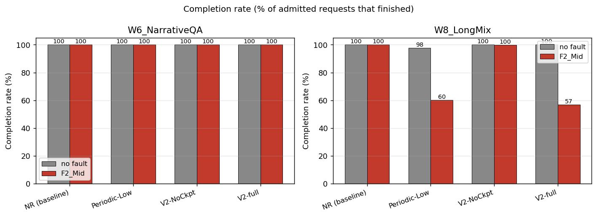

W8_LongMix / F2_Mid 下：

| Baseline | seed=42 | seed=123 | seed=456 | mean |
|---|---|---|---|---|
| NR | 100% | 100% | 100% | 100% |
| V2-NoCkpt | 99.2% | 100% | 100% | 99.7% |
| **V2-full** | **32.3%** | **39.2%** | 99.2% | **56.9%** |
| Periodic-Low | — | — | — | 60.2% |

V2-full 在 3 个 seed 里 2 个崩到 32–39%——故障注入后系统恢复不过来，大量 in-flight 请求超时丢弃。第 3 个 seed 居然恢复到 99.2%，说明**行为高度不稳定**。

### L40S

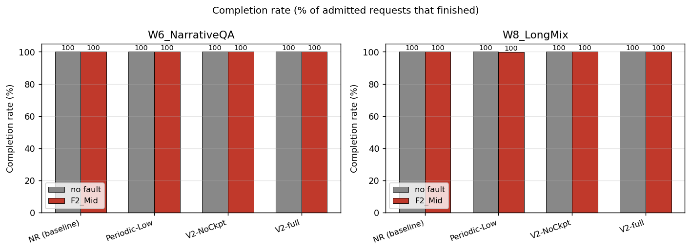

| Baseline | mean (W8/F2_Mid) |
|---|---|
| NR | 100% |
| V2-NoCkpt | 100% |
| **V2-full** | **100%** ⬆ |
| Periodic-Low | 99.7% |

L40S 上 V2-full 完成率回到 100%——**算力 + PCIe 余量缓解了灾难性丢请求**。但完成率 100% 不等于赢——V2-full 在 goodput / TPOT / SLO 三个维度仍然全输。

---

## 5. TPOT p95：V2-full 的"罪证"

### A6000

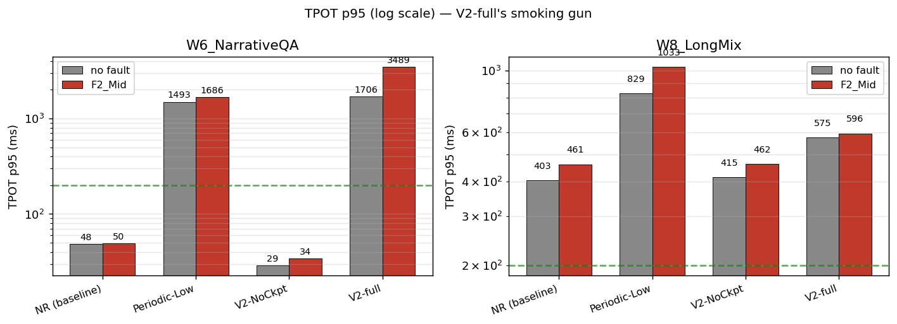

| Workload | Fault | NR | V2-NoCkpt | V2-full |
|---|---|---|---|---|
| W6 | none | 48 ms | 29 ms | **1706 ms** |
| W6 | F2_Mid | 50 ms | 34 ms | **3489 ms** |
| W8 | none | 403 ms | 415 ms | **575 ms** |
| W8 | F2_Mid | 461 ms | 462 ms | **595 ms** |

### L40S

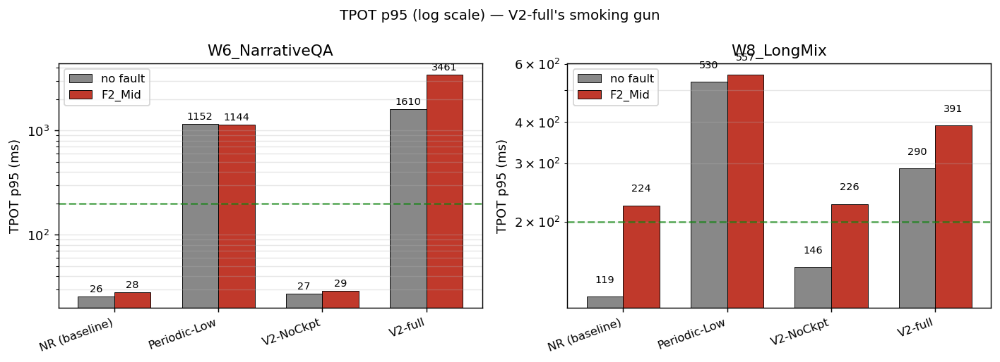

| Workload | Fault | NR | V2-NoCkpt | V2-full |
|---|---|---|---|---|
| W6 | none | 26 ms | 27 ms | **1610 ms** |
| W6 | F2_Mid | 28 ms | 29 ms | **3461 ms** |
| W8 | none | 119 ms | 146 ms | 290 ms |
| W8 | F2_Mid | 224 ms | 226 ms | 391 ms |

W6 上 V2-full 的 TPOT 在两台机器上**几乎完全一样**（A6000: 1706/3489 ms vs L40S: 1610/3461 ms）——比 NR 慢 **35–125 倍**（绿色虚线是 SLO=200ms）。**这是 V2-full 失败的直接证据**：

> checkpoint 机制在 decode 期间复制 KV，和正常 token 生成抢 GPU 计算+PCIe 带宽，让每 token 间隔从 30ms 拉到 1700ms。**硬件升级救不了**——L40S 把 W8 的 TPOT 大致减半，但 W6 几乎没变化。

V2-NoCkpt 关掉 checkpoint 后立刻和 NR 持平（两台机器都一致）——证明问题在 checkpoint 持续运行的开销，不在 Benders solver。

---

## 6. SLO 违规率

### A6000

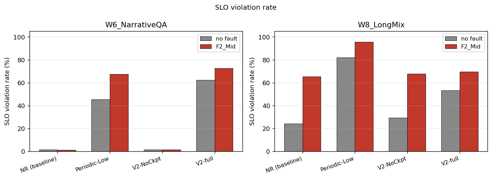

### L40S

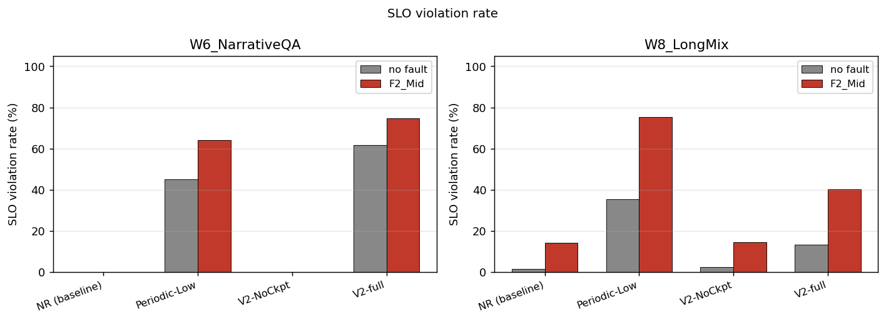

| Workload | Fault | NR (A6) | V2-full (A6) | NR (L40) | V2-full (L40) |
|---|---|---|---|---|---|
| W6 | none | 0% | **60%** | 0% | **62%** |
| W6 | F2_Mid | 0% | **73%** | 0% | **75%** |
| W8 | none | — | — | 1% | 13% |
| W8 | F2_Mid | — | — | 14% | 40% |

V2-full 在 W6 上 SLO 违规率两机一致（60–75%），即便 SLO 已经放宽到 12s/200ms——原因就是上面 TPOT 飙到秒级，大量请求 TPOT 超过 200ms 阈值。

---

## 7. 诊断：为什么长上下文也救不了

Step 5 的初衷源于 Step 4 的测量：长上下文下 re-prefill 比 reload 贵 21–83 倍，理论上 checkpoint 应该赢。**这个比例没错，但前提是 checkpoint 能干干净净地恢复**。问题是：

1. **V2 的 checkpoint 是连续运行的**，每出现一个新稳定 KV block 就触发判断+复制，**整个 run 期间都在抢资源**。即使没故障也付出 60% 以上的 goodput 代价。
2. **长上下文让 KV 单次复制变大**：32K context × 8B 模型 ≈ 4GB KV/请求，复制一次更慢，对 decode 的干扰窗口更长。
3. **PCIe 带宽是双向共享的**：vLLM 的 prefetch、output 回传、checkpoint 复制都过 PCIe。长上下文 prefill 阶段本就对 PCIe 重压，再叠加 checkpoint 复制就崩了。
4. **故障下 V2-full 反而更糟**：本来应该靠 reload 节省时间，但 reload 期间累积的延迟把 in-flight 请求全推过 SLO，结果丢得比 NR 直接 re-prefill 还多。

之前导师讨论里识别的 **Mode 4（系统级争用）+ Mode 5（价值不成立）依然成立，长上下文不仅没改变本质，反而放大了问题**。

**L40S 复现进一步坐实了诊断**：
- W6 上的 TPOT 灾难（~1700 ms / ~3500 ms）和 A6000 几乎完全相同 —— checkpoint 干扰是结构性问题，不是带宽不够
- 即使 L40S 的算力 + PCIe 余量缓解了完成率崩盘（W8/F2 从 56.9% 升到 100%），**V2-full 仍然 12/12 全输 NR**
- W8 上 L40S 缩小但不消除 V2-full 的 gap（−7% 到 −25%）—— 算力够强能"撑住"checkpoint 干扰，也无法超过没付 checkpoint 代价的 NR

---

## 8. 选项

| 方向 | 思路 | 代价 | 概率 |
|---|---|---|---|
| ~~**A. 等 L40S 结果**~~ ✅ 已验证 | L40S KV 带宽快 16%（20.4 vs 17.6 GB/s） | 已完成 | **结论不变 — 见 Section 2-7** |
| **B. 异步 checkpoint** | 让 checkpoint 复制脱离 critical path（独立线程、独立 PCIe channel） | 大改架构（数周） | 中等 |
| **C. 接受 V2-NoCkpt 路线** | 丢掉 checkpoint，纯 Benders + admission control | 故事好讲度低（V2-NoCkpt 也只是和 NR 持平） | 论文难发 |
| **D. 换设定** | 70B / 多节点 TP / PCIe 慢速链路，让 re-prefill 真的秒级到分钟级 | 需要新硬件 | 较高 |

**建议**：今天把这个数据带去和导师讨论方向。Step 5 的主要价值是**严格证伪**了「长上下文能救 V2」这个假设——这本身是有用的负面结果，但不是论文卖点。

---
## 附：数据原始路径

- 实验结果：
  - A6000：`results_v2/8B/Step5_Main/<baseline>/<workload>/Moderate/<fault>/<seed>/`
  - **L40S：`results_v2_l40s/8B/Step5_Main/<baseline>/<workload>/Moderate/<fault>/<seed>/`**
  - 每个 trial 含 `metrics.json` / `requests.csv` / `epochs.csv` / `recoveries.json` / `run_meta.json` / `server.log`
- 图：
  - A6000：`experiments_v2/figures/8B/Step5_Main/`
  - L40S：`experiments_v2/figures/8B/Step5_Main_l40s/`
- Config：
  - A6000：`experiments_v2/config_8b_step5.yaml`
  - L40S：`experiments_v2/config_8b_step5_l40s.yaml`
- Cost profile：
  - A6000：`experiments_v2/checkpoint_cost_profile_a6000.json`
  - L40S：`experiments_v2/checkpoint_cost_profile_l40s.json`
- 画图脚本：`experiments_v2/plot_step5.py`（加了 `--results-dir` / `--out-dir` 命令行参数，可同时支持 A6000 和 L40S）
