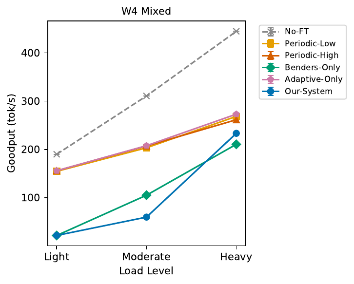
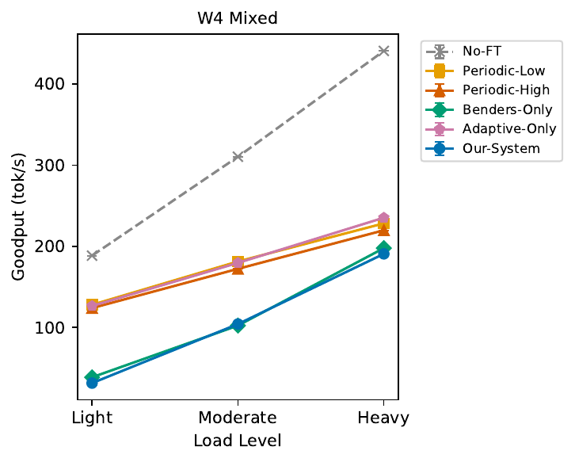
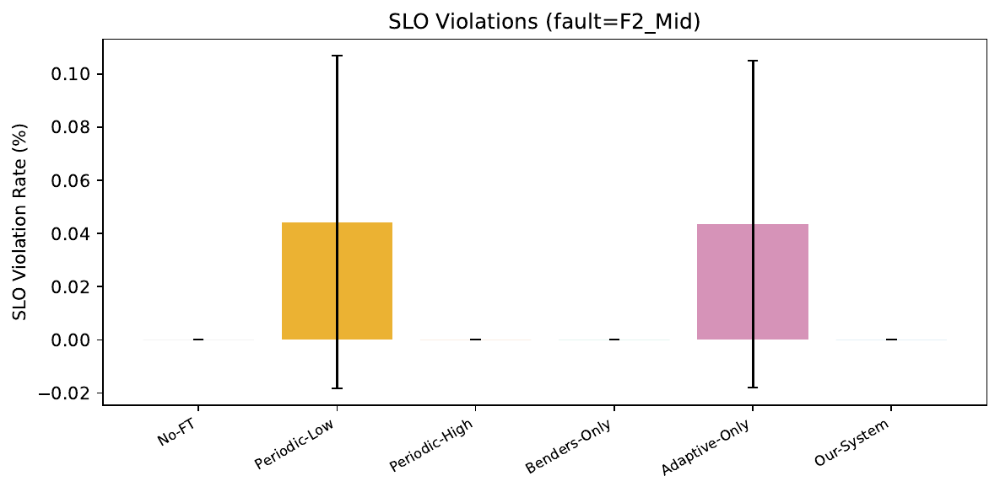
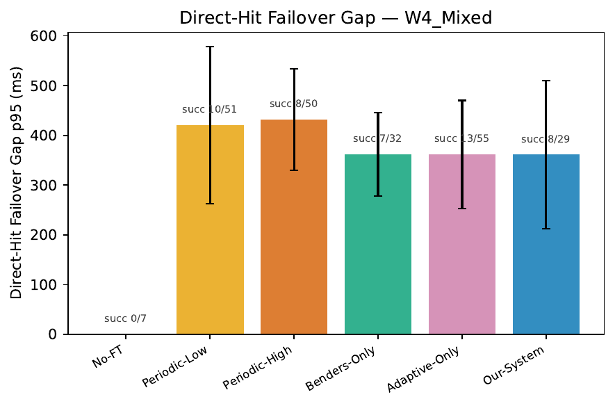
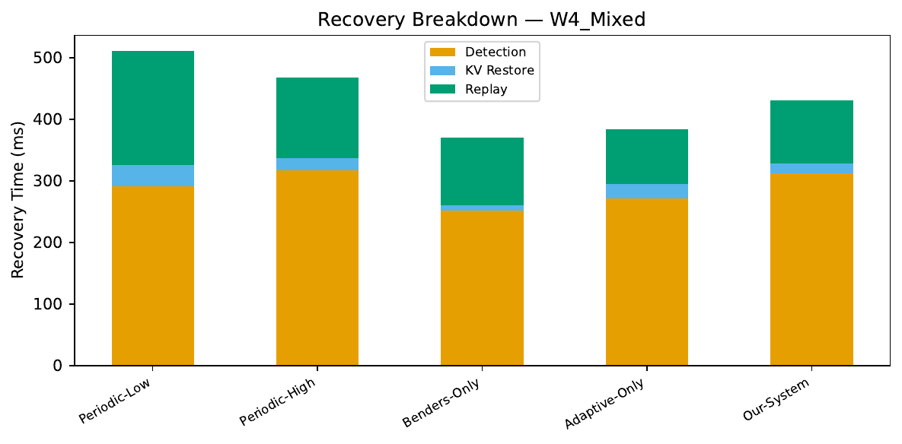
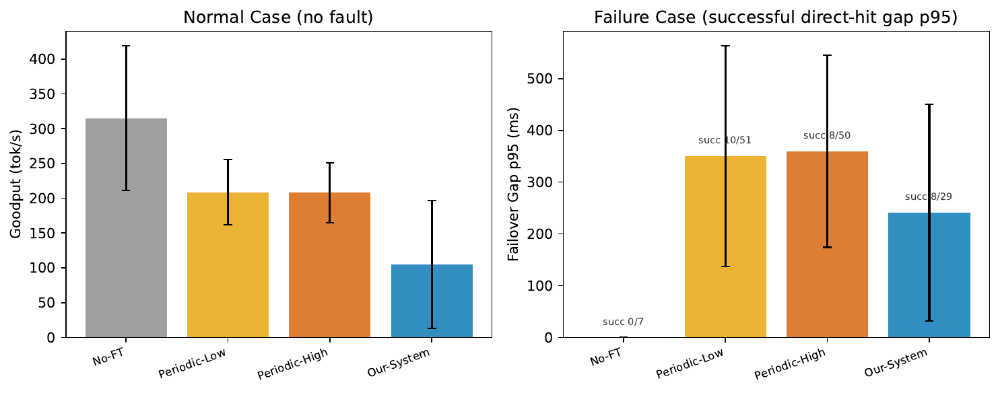
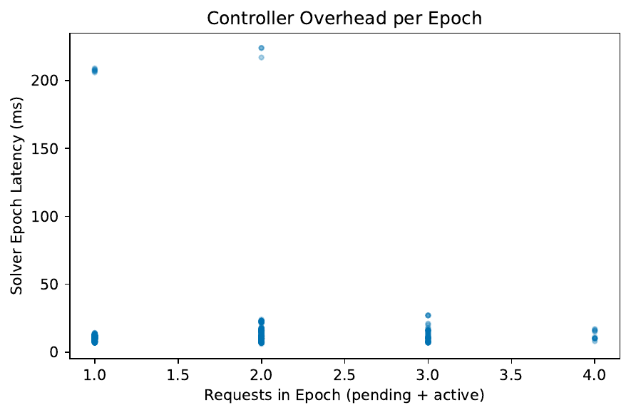

# E1a_Tonight 实验结果

调参后（prefill=40000, decode=150, horizon=0.5），54 runs 全部成功，6.5 小时完成。

设置：1B 模型, dp=2, W4_Mixed, 3 loads × 3 faults × 6 baselines, seed=42, 300s/run

---

## Slide 1: Goodput vs Load（无故障）

### 分析
- **No-FT 遥遥领先**（190→311→445 tok/s）：零 FT 开销，是 goodput 的天花板
- **Periodic-Low / Periodic-High / Adaptive-Only 紧密聚在一起**（155→207→270）：checkpoint 开销相近，差距 < 5%
- **Benders-Only 和 Our-System 严重偏低**：
  - Light: 只有 22 tok/s（No-FT 的 11%）
  - Moderate: 60-105 tok/s（No-FT 的 20-34%）
  - Heavy: 210-233 tok/s（追上来了，但仍低 47%）
- **结论：调参后 Benders 仍然过于保守**。低负载下拒绝更严重（Light 只有 38% 完成率）

---

## Slide 2: Goodput vs Load（F2_Mid 故障）

### 分析
- 趋势和无故障基本一致——**故障对 goodput 的影响很小**
- No-FT 有故障时 goodput 几乎不变（445→441）：故障丢的请求很少，不影响整体
- Benders 系列在 Heavy 下追上其他 FT baseline（190-198 vs 220-235）
- **问题不变：Benders 在 Light/Moderate 下过度拒绝**

---

## Slide 3: SLO Violation

### 分析
- 大部分 baseline SLO violation ≈ 0%
- **Periodic-Low 和 Adaptive-Only 有 ~0.04% violation**（误差棒很大）
- violation 极低是因为 SLO 太松（TPOT SLO 50ms，实际 TPOT 7-22ms）
- 这张图目前没有区分度，需要在更高负载或更严 SLO 下才有意义

---

## Slide 4: Failover Gap P95

### 分析
- **No-FT：succ 0/7** — 7 个 direct-hit 请求全部丢失，0 恢复
- **Periodic-Low：~420ms，succ 10/51** — 恢复成功率只有 20%
- **Periodic-High：~435ms，succ 8/50** — 恢复率 16%，checkpoint 存多了反而 gap 更大
- **Benders-Only：~365ms，succ 7/32** — gap 较低但恢复率 22%
- **Adaptive-Only：~365ms，succ 13/55** — 恢复率 24%
- **Our-System：~365ms，succ 8/29** — gap 最低之一，恢复率 28%
- **所有 FT baseline 恢复成功率都很低（16-28%）**——这是 dp=2 的问题，故障后存活 GPU 过载

---

## Slide 5: Recovery Breakdown

### 分析
- **Detection 时间**占大头（所有 baseline 约 260-320ms）
- **Periodic-Low**：replay 最大（~200ms），因为 checkpoint 存的少
- **Periodic-High**：KV restore 最大（~30ms），checkpoint 存的多，但 replay 也不小（~140ms）
- **Benders-Only / Adaptive-Only / Our-System**：总恢复时间 370-435ms
- **Our-System 的 KV restore 比 Benders-Only 大**——说明自适应 checkpoint 确实存了更多，但 replay 也不少

---

## Slide 6: Checkpoint Tradeoff

### 分析
- **左图（无故障 goodput）**：No-FT 最高 (315)，Periodic-Low/High 约 207，Our-System 最低 (105)
  - Our-System 低不是 checkpoint 开销，是 Benders 拒绝请求导致
- **右图（故障 gap P95）**：Our-System gap 最低 (~240ms)，Periodic-Low/High 约 350ms
  - No-FT: succ 0/7（不恢复）
- **Our-System 在恢复质量上确实最好**，但正常态 goodput 被 solver 拖了后腿

---

## Slide 7: Controller Overhead

### 分析
- 绝大多数 epoch 10-20ms
- 两个 outlier ~210-220ms（冷启动，首次调用）
- 不随请求数增长（1-4 个请求范围内平稳）
- **结论：solver 开销可接受**

---

## Slide 8: 核心发现

### 调参后 vs 调参前
| 指标 | 调参前 (tiny) | 调参后 (tonight) |
|---|---|---|
| Our-System 完成率 (无故障,Moderate) | 64.3% | **42.7%（更差了）** |
| Our-System goodput (无故障,Moderate) | 217.8 | **59.8（更差了）** |

**调参没有解决问题，反而让 Benders 在 Light/Moderate 下表现更差**。

### 根因分析（更新）
调参前的问题是 `ft_prefill_throughput` 太低导致 solver 高估 replay 开销。调参后把 prefill 调高了，但 `ft_decode_throughput` 从 2000 调到了 150——**solver 现在认为 decode 极慢（每请求只有 150 tok/s）**，在计算 planning horizon 内的容量时，认为系统撑不了几个请求 → 拒绝更多。

问题从"高估 replay"变成了"低估系统容量"。

### 真正需要修的
`ft_decode_throughput` 的语义是**系统级 decode 吞吐**（所有请求合计），不是单请求的 TPOT。实际系统在 batch 情况下 decode 吞吐远高于单请求的 143 tok/s。应该设为 batch decode 吞吐，大约 2000-4000 tok/s。

---

## Slide 9: 下一步

### 立即
1. **再次调参**：`ft_decode_throughput` 改回 2000 或更高（batch decode 吞吐）
2. 只改 Our-System 和 Benders-Only 重跑，不需要全部 54 runs

### 短期
3. 把 solver 参数校准加入 calibrate.py（自动从实测数据推算）
4. 确认 Benders 完成率 > 90% 后，再跑完整实验

### 经验教训
- `ft_prefill_throughput`：**系统级 prefill 吞吐**（~40000 对 1B 合理）
- `ft_decode_throughput`：**系统级 batch decode 吞吐**（不是单请求 TPOT 的倒数）
- 这两个参数的语义需要在代码和文档中明确
