# 8B 实验结果分析报告

所有 bug 修复后的结果。Config: `config_8b_calibrated.yaml`，max_model_len=8192，dp=2，seed=42。

模型：Llama-3.1-8B-Instruct，硬件：2×NVIDIA RTX A6000 48GB。

---

## 1. E0_Smoke — Pipeline 验证 (4 runs)

| Baseline | Fault | Goodput | 完成率 | SLO Viol | TPOT P95 | 恢复率 |
|---|---|---|---|---|---|---|
| No-FT | none | 223.1 | 98.8% | 0.0% | 29.9ms | — |
| No-FT | F2_Mid | 216.0 | 96.8% | 0.0% | 37.8ms | 0% |
| Our-System | none | 174.8 | 98.4% | 18.9% | 80.3ms | — |
| Our-System | F2_Mid | 120.5 | 98.4% | 45.5% | 125.2ms | 100% |

### Goodput

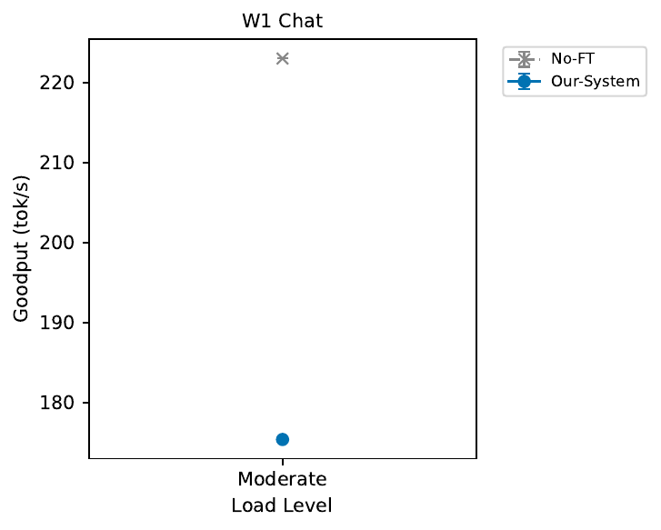

### SLO Violation

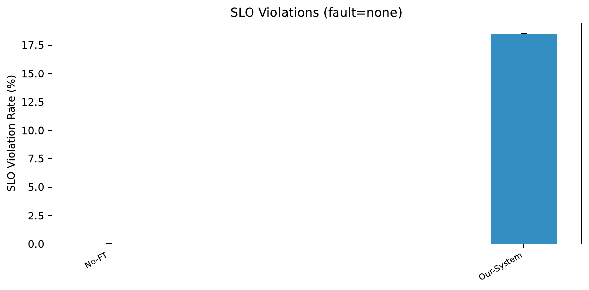
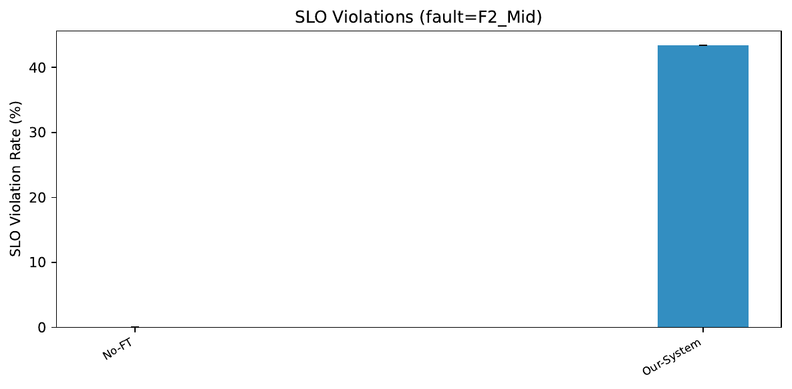

### 要点
- Checkpoint 正常 publish，恢复率 100%
- Our-System 正常态 goodput 比 No-FT 低 22%（FT 开销）
- SLO violation 高（18-45%）——TPOT 80-125ms 超过 50ms SLO

---

## 2. E1a_Quick — 端到端主结果 (48 runs, 1 failed)

47 ok, 1 failed（Periodic-High/W1_Chat/Heavy/none，prompt+output 超 max_model_len=4096，已改为 8192）。

### Goodput vs Load

**无故障：**

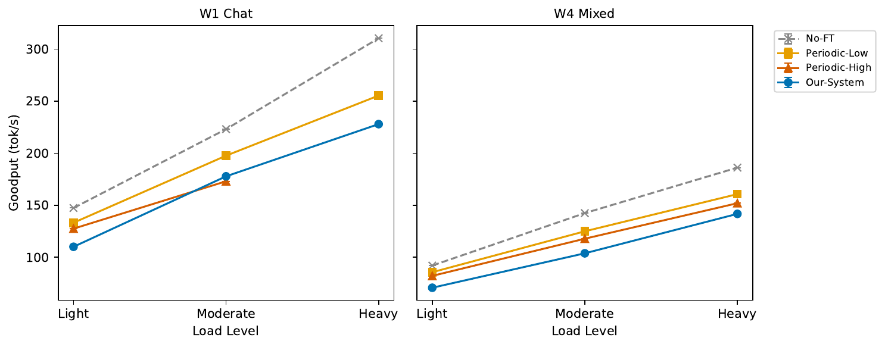

**有故障 (F2_Mid)：**

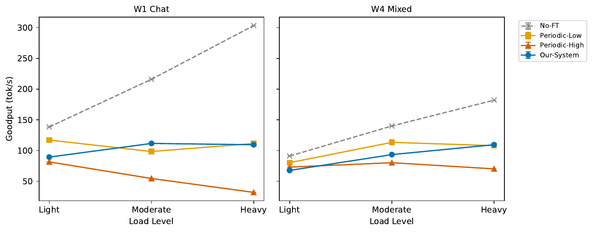

### 无故障 Goodput 数据

| Baseline | W1_Chat Light | W1_Chat Mod | W1_Chat Heavy | W4_Mixed Light | W4_Mixed Mod | W4_Mixed Heavy |
|---|---|---|---|---|---|---|
| No-FT | 147.3 | 223.1 | 310.4 | 92.0 | 142.4 | 186.1 |
| Periodic-Low | 133.2 | 197.6 | 255.3 | 85.6 | 124.9 | 160.7 |
| Periodic-High | 127.5 | 173.0 | (fail) | 82.1 | 117.8 | 151.9 |
| Our-System | 110.1 | 177.8 | 227.9 | 70.7 | 103.8 | 141.7 |

### 有故障 Goodput 数据

| Baseline | W1_Chat Light | W1_Chat Mod | W1_Chat Heavy | W4_Mixed Light | W4_Mixed Mod | W4_Mixed Heavy |
|---|---|---|---|---|---|---|
| No-FT | 138.5 | 216.0 | 303.4 | 91.1 | 140.1 | 182.1 |
| Periodic-Low | 117.1 | 98.5 | 111.5 | 80.3 | 113.4 | 108.0 |
| Periodic-High | 81.6 | 54.6 | 32.0 | 73.1 | 80.3 | 70.2 |
| Our-System | 89.4 | 111.7 | 109.5 | 67.7 | 93.5 | 109.5 |

### SLO Violation

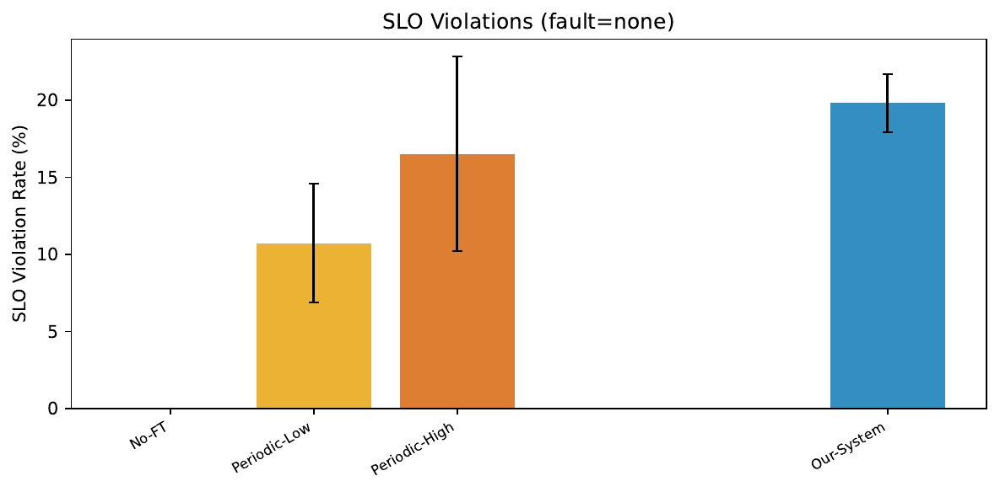
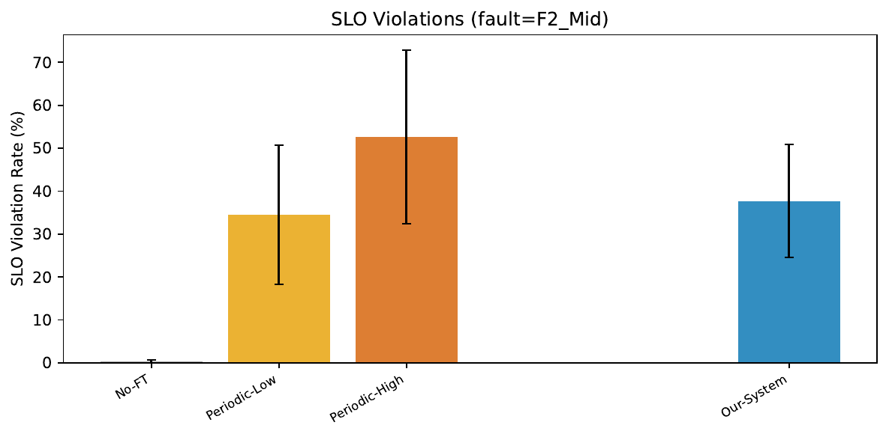

### Failover Gap

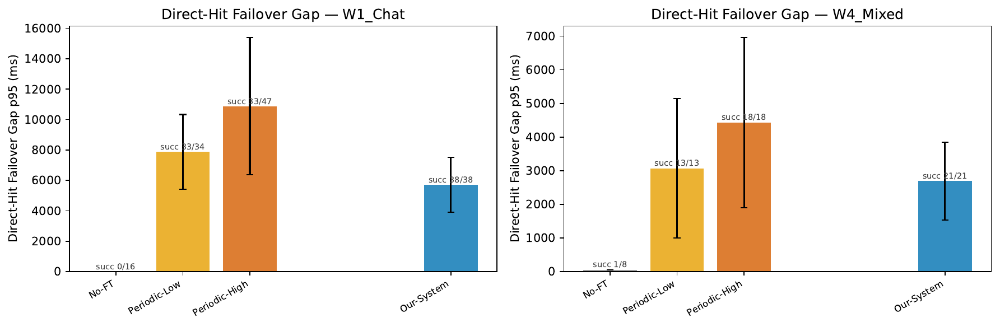

### Recovery Breakdown

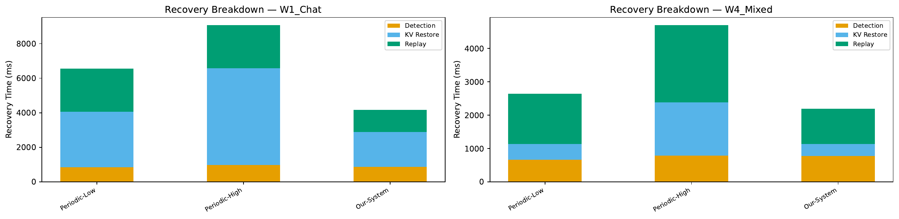

### Checkpoint Tradeoff

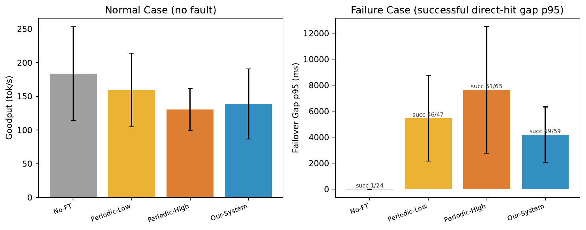

### Controller Overhead

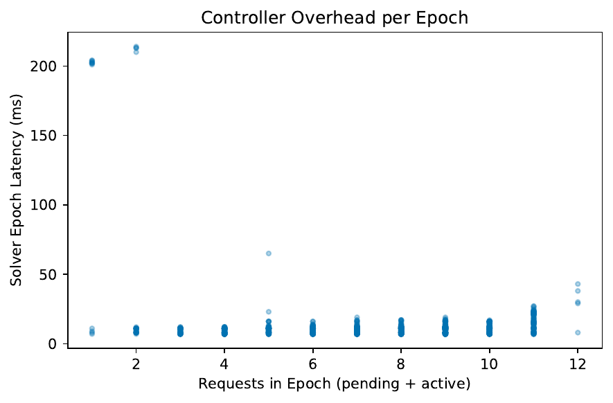

### Goodput Timeline (故障前后)

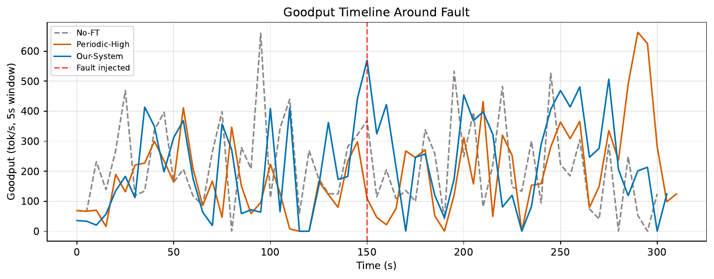

### 恢复率

| Baseline | 恢复率范围 | 说明 |
|---|---|---|
| No-FT | 0-25% | 基本不恢复 |
| Periodic-Low | 85-100% | 大部分恢复 |
| Periodic-High | 47-100% | Heavy 负载下恢复率低 |
| Our-System | 100% | **全部恢复** |

### 要点

- **无故障**：No-FT > Periodic-Low > Our-System ≈ Periodic-High。FT 开销 10-25%
- **有故障**：
  - No-FT goodput 几乎不降，但恢复率 0%
  - **Periodic-High 故障后最差**（Heavy 只有 32 tok/s），checkpoint 太频繁拖慢恢复
  - Our-System 故障后稳定（109-111 tok/s），**恢复率 100%**
- **Our-System 的优势在 Heavy + 故障场景**：goodput 109.5 vs Periodic-High 32.0

---

## 3. E2_Recovery — 恢复时间分解 (8 runs)

### Recovery Breakdown

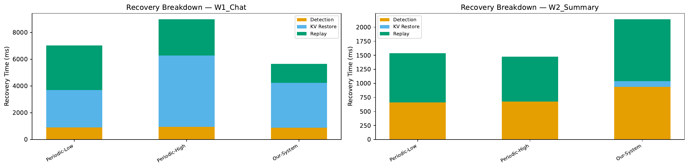

### Recovery Gap CDF

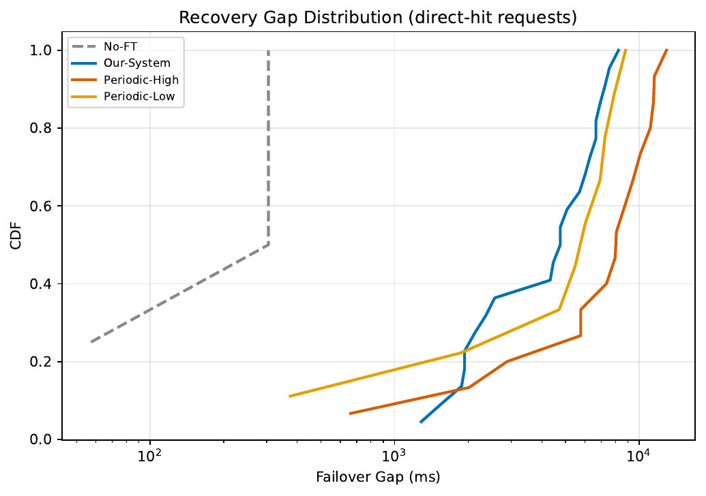

### 数据

| Baseline | Workload | Goodput | 完成率 | SLO Viol | TPOT P95 | Gap P95 | 恢复率 |
|---|---|---|---|---|---|---|---|
| No-FT | W1_Chat | 219.8 | 98.0% | 0.0% | 37.7ms | — | 0% |
| No-FT | W2_Summary | 55.0 | 99.6% | 0.0% | 31.1ms | — | 0% |
| Periodic-Low | W1_Chat | 91.8 | 100.0% | 53.2% | 155.4ms | 8495ms | 100% |
| Periodic-Low | W2_Summary | 53.9 | 100.0% | 2.4% | 84.3ms | 374ms | 100% |
| Periodic-High | W1_Chat | 54.5 | 94.4% | 70.1% | 264.5ms | 12177ms | 85.7% |
| Periodic-High | W2_Summary | 53.4 | 100.0% | 3.2% | 97.8ms | 661ms | 100% |
| Our-System | W1_Chat | 106.9 | 99.6% | 48.6% | 129.7ms | 7666ms | 100% |
| Our-System | W2_Summary | 46.9 | 99.2% | 12.2% | 100.6ms | 2297ms | 100% |

### 要点

- **Periodic-High 反而比 Periodic-Low 差**：gap 12177ms vs 8495ms，恢复率 85.7% vs 100%。checkpoint 太频繁的开销 > 恢复收益
- **Our-System gap 最小**（W1_Chat 7666ms），但仍远超 3s gap SLO
- **W2_Summary 恢复快**（gap 374-2297ms）——短 decode 请求恢复容易

---

## 4. E3_Ablation — 消融实验 (40 runs)

### Ablation 对比（无故障）

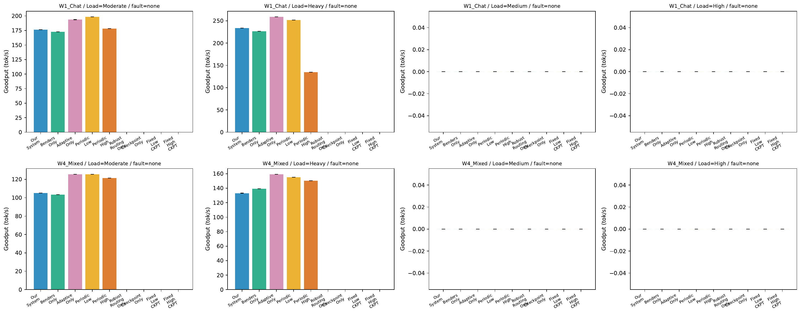

### Ablation 对比（有故障 F2_Mid）

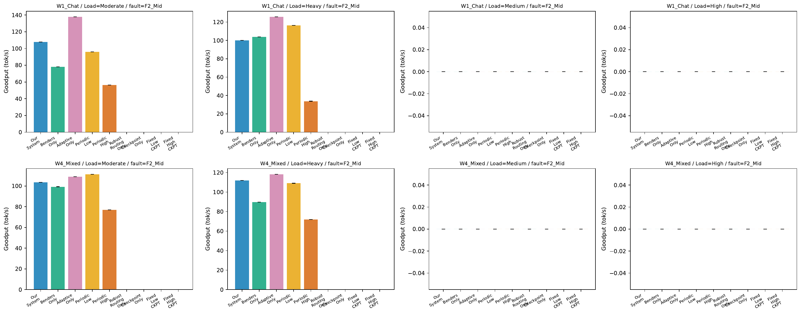

### Ablation Heatmap

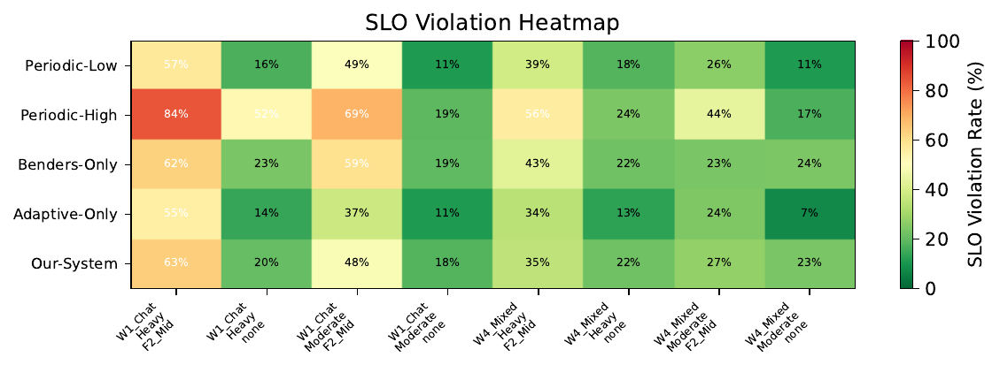

### 无故障 Goodput

| Baseline | W1_Chat Mod | W1_Chat Heavy | W4_Mixed Mod | W4_Mixed Heavy |
|---|---|---|---|---|
| Periodic-Low | 198.3 | 251.5 | 125.4 | 155.2 |
| Periodic-High | 178.3 | 134.8 | 121.5 | 150.4 |
| Adaptive-Only | **193.6** | **258.8** | **125.5** | **159.2** |
| Benders-Only | 172.6 | 226.5 | 103.4 | 139.2 |
| Our-System | 176.4 | 233.9 | 105.2 | 133.2 |

### 有故障 Goodput

| Baseline | W1_Chat Mod | W1_Chat Heavy | W4_Mixed Mod | W4_Mixed Heavy |
|---|---|---|---|---|
| Periodic-Low | 96.0 | 116.4 | 111.3 | 109.0 |
| Periodic-High | 56.3 | 33.8 | 76.9 | 71.8 |
| Adaptive-Only | **137.7** | **125.6** | 109.0 | **118.2** |
| Benders-Only | 78.2 | 103.9 | 99.3 | 89.7 |
| Our-System | 107.7 | 100.2 | **103.5** | 111.8 |

### 要点

- **Adaptive-Only 最强**：无故障 goodput 最高，有故障 W1_Chat 也最高（125-137）
- **Benders-Only 不如 Adaptive-Only**：solver 链路开销 > routing 收益（dp=2 下）
- **Our-System 介于两者之间**：Benders 开销部分抵消了自适应 ckpt 的收益
- **结论：当前 dp=2 下，自适应 checkpoint 是主要贡献者，Benders routing 在更多 GPU 下才有价值**

---

## 5. 总结

### 系统验证 ✅
- Checkpoint 正常 publish
- 故障恢复正常工作（Our-System 恢复率 100%）
- Solver 正常收敛

### 核心发现

1. **Our-System 恢复率 100%**，其他 baseline 最高 85-100%
2. **Periodic-High（每 1 block checkpoint）是最差的 FT 策略**——开销大、恢复慢
3. **自适应 checkpoint 是主要贡献者**（Adaptive-Only > Benders-Only）
4. **Benders solver 在 dp=2 下开销 > 收益**——需要 dp=4+ 展示 routing 价值

### 待解决

| 问题 | 现状 | 方向 |
|---|---|---|
| SLO violation 高 | 所有 FT baseline TPOT 超 50ms | 异步 checkpoint + 异步 solver |
| Failover gap 大 | W1_Chat gap 7-12s，超 3s SLO | 更快的 restore 或更少的 replay |
| Solver 开销 | dp=2 下得不偿失 | 扩展到 dp=4，或异步化 |
