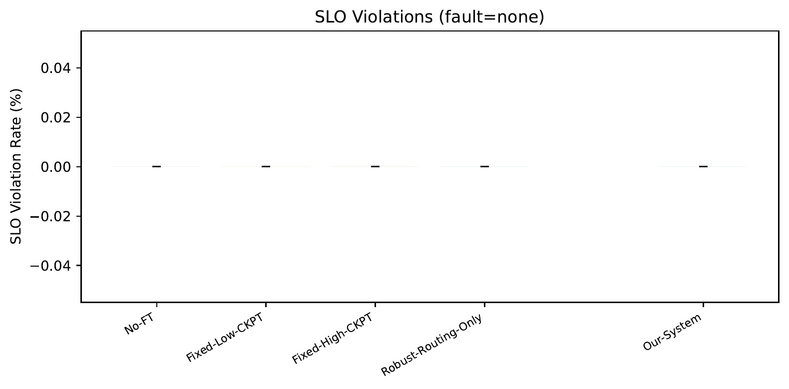
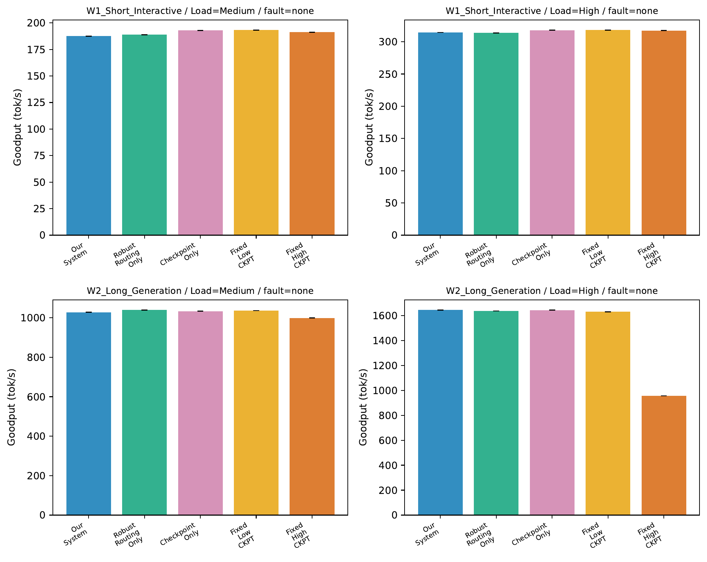

# Fault-Tolerant Multi-GPU LLM Serving with Adaptive KV-Cache Checkpointing

## Progress Update — Yi Zhong

---

## Slide 1: Problem

- 单机多GPU LLM serving，GPU会挂（reset、OOM、driver crash…）
- 挂了 → 容量丢失 → token流中断、SLO violation、goodput下降
- 朴素checkpoint：存太频繁开销大，存太少恢复慢
- **核心问题：如何联合优化 routing、admission、自适应checkpoint，在故障下最大化goodput并满足SLO？**

---

## Slide 2: Our System

### ① Benders-based Robust Scheduler
- 周期性决策（epoch），基于当前系统snapshot
- Master problem：决定admission + routing
- Subproblem：对每种故障场景验证recovery可行性
- Pooled-flow recovery screening + logic-based cuts

### ② Adaptive Checkpoint Policy
- 运行时、per-request、当新的stable KV block出现时触发
- 发布条件：`Δreplay_saved > Δload + λ·Δckpt_overhead`
- 生成早期：跳过（replay很便宜）
- 生成后期：checkpoint（丢不起）

### Baselines
| Baseline | 说明 |
|---|---|
| No-FT | 完全没有容错 |
| Fixed-Low-CKPT | 固定低频checkpoint（每10个block） |
| Fixed-High-CKPT | 固定高频checkpoint（每1个block） |
| Robust-Routing-Only | Benders routing + 固定低频ckpt |
| Checkpoint-Only | 自适应ckpt + 贪心routing |

---

## Slide 3: Experiment Setup

### Hardware & Model
- Llama-3.2-1B-Instruct，2 GPUs（DP replicas），8GB checkpoint pool（host RAM）

### Workloads
| Workload | Prompt | Output | Arrival |
|---|---|---|---|
| W1 Short Interactive | 50-200 | 20-100 | Poisson |
| W2 Long Generation | 200-500 | 200-500 | Poisson |
| W3 Bursty Mixed | 50-500 | 20-500 | Bursty |

### Load & Faults
- Load：Low (1 rps), Medium (3 rps), High (5 rps)
- Faults：none / F1_Early (15s) / F2_Mid (30s) / F3_Late (50s)
- Duration：70s per run
- SLO：TTFT 2s, TPOT 100ms, Failover gap 3s

### 5个实验
| 实验 | 目的 | 关键指标 |
|---|---|---|
| E1: Main | 端到端全面对比 | Goodput, SLO violation, failover gap |
| E2: Recovery | 恢复时间拆解 | Detection / KV Restore / Replay |
| E3: Ablation | Routing vs Checkpoint各自贡献 | Goodput by component |
| E4: Tradeoff | Checkpoint开销 vs 恢复收益 | Goodput + failover gap |
| E5: Controller | 求解器开销 | Solver latency per epoch |

---

## Slide 4: E1 Goodput — 无故障

### 要点
- 所有方法 ≈ No-FT → **我们的系统正常态开销几乎为零**
- 唯一例外：**Fixed-High-CKPT** 在 W2/High 下只有 ~1216 tok/s（No-FT ~1715），被拷贝开销拖了约 29%

---

## Slide 5: E1 Goodput — 有故障 (F2_Mid)

### 要点
- No-FT 的 goodput 看起来高，但它**静默丢弃了被故障命中的请求**（completion rate 97-99%，failover成功率 0%）
- Our-System 在 W2/Med (~1040) 与 Fixed-Low 持平，且 completion rate 100%
- Our-System 在 W2/High 下 completion 88.5%，低于 No-FT 的 97%，但 No-FT 是直接丢弃无法恢复
- Fixed-High-CKPT 最差：正常态就亏 + 恢复慢 + completion 也低（W2/High ~80%）

---

## Slide 6: E1 SLO Violations

### 要点
- 无故障：所有方法 SLO violation = 0%
- 有故障：**Fixed-High-CKPT** 平均 ~7%（最高 20%+）；**Our-System ≈ 0%**

---

## Slide 7: E1 Failover Gap (p95)

### 要点
- No-FT：W2/W3 恢复成功率 0%（succ 0/34, 0/27）
- Fixed-High-CKPT：gap 最大（W2 ~700ms）+ 成功率最低（77/117 = 66%）
- **Our-System：gap 适中 + 成功率最高**（W3: 90/97 = 93%）
- 分母不同是因为不同方法在故障时刻的在飞请求数不同（Fixed-High 因开销大导致更多请求堆积）

---

## Slide 8: E2 Recovery Time Breakdown

### 要点
- **W1（短任务）**：Detection 占大头（~200ms），三种方法差不多
- **W2（长任务）**：差异明显
  - Fixed-High-CKPT ~830ms（KV Restore 太大）
  - Fixed-Low-CKPT ~350ms
  - **Our-System ~330ms**
- 自适应 checkpoint 的优势：存得不多不少，恢复时 KV Restore 和 Replay 都不大 → **sweet spot**

---

## Slide 9: E3 Ablation — 有故障 (F2_Mid)

### 要点
- **W1（短任务）**：所有方法差不多，短任务容错压力小
- **W2/Medium**：Our-System (~1042) ≈ Checkpoint-Only (~1048) >> Robust-Routing-Only (~666)
- **结论：自适应 checkpoint 是主要贡献者**；routing 在当前 2-GPU 规模下增益有限，在高负载下稍有帮助

---

## Slide 10: E3 Ablation — 无故障

### 要点
- Our-System / Robust-Routing / Checkpoint-Only / Fixed-Low 都差不多
- **Fixed-High-CKPT**：W2/High 只有 ~960 vs 其他 ~1640（纯拷贝开销导致 -40%）

---

## Slide 11: E4 Checkpoint Overhead vs Recovery Benefit

### 要点
- **左图（无故障 goodput）**：Fixed-High-CKPT 亏 ~29%（988 vs No-FT 1384）；其他 ≈ No-FT
- **右图（故障 failover gap + 成功率）**：
  - No-FT：0/10 恢复
  - Fixed-Low：23/26 (88%)，gap ~541ms
  - Fixed-High：22/39 (56%)，gap ~883ms — 存了最多反而最差
  - **Our-System：27/27 (100%)，gap ~491ms — 两个维度都最好**
- **核心 trade-off 故事：checkpoint 不是越多越好**

---

## Slide 12: E5 Controller Overhead

### 要点
- Solver 中位延迟：**~15ms per epoch**，不随请求数（1-12）增长
- Outlier 160-180ms：冷启动（前 1-2 次调用），可通过 warmup 消除
- 99th percentile ~40ms
- 对于在线 serving 来说完全可接受（decode step 本身就是 ms 级别）

---

## Slide 13: Summary

### Key Findings
1. **正常态开销几乎为零**：和 No-FT 的 goodput 齐平
2. **故障态最优**：恢复成功率最高 + SLO violation 最低
3. **Checkpoint 不是越多越好**：Fixed-High 正常亏 goodput，故障恢复还更慢
4. **自适应 checkpoint 是主要功臣**；robust routing 在大规模下会更重要
5. **Solver 开销小**：~15ms per epoch

### Next Steps
- 扩展到更多 GPU（4-8），展示 routing 的收益
- 更多 random seeds，增强统计显著性
- 更强的 cut generation（超越 no-good cuts）
- 真实 GPU 故障注入（不只是 kill 进程）
