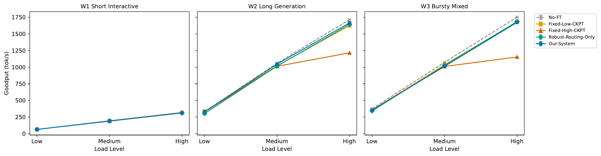
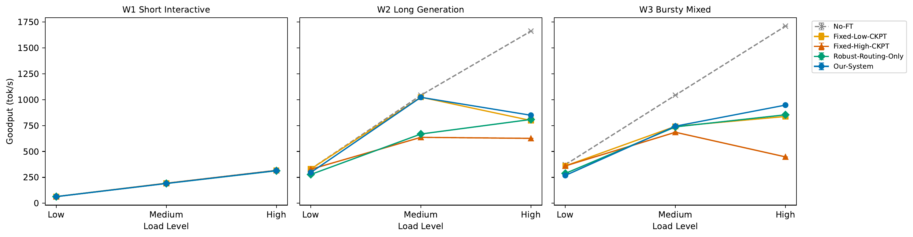
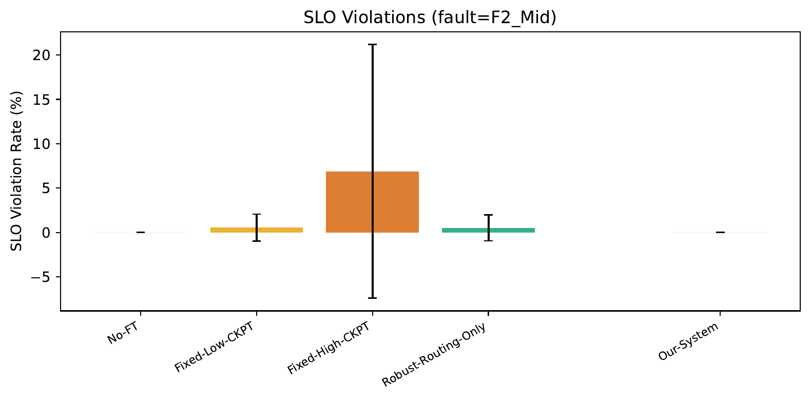
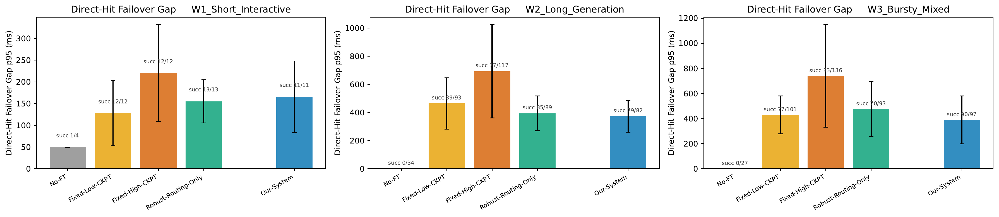
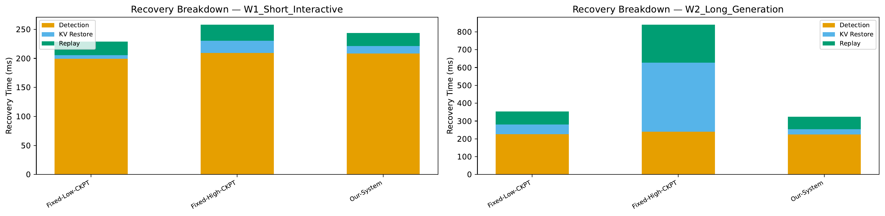
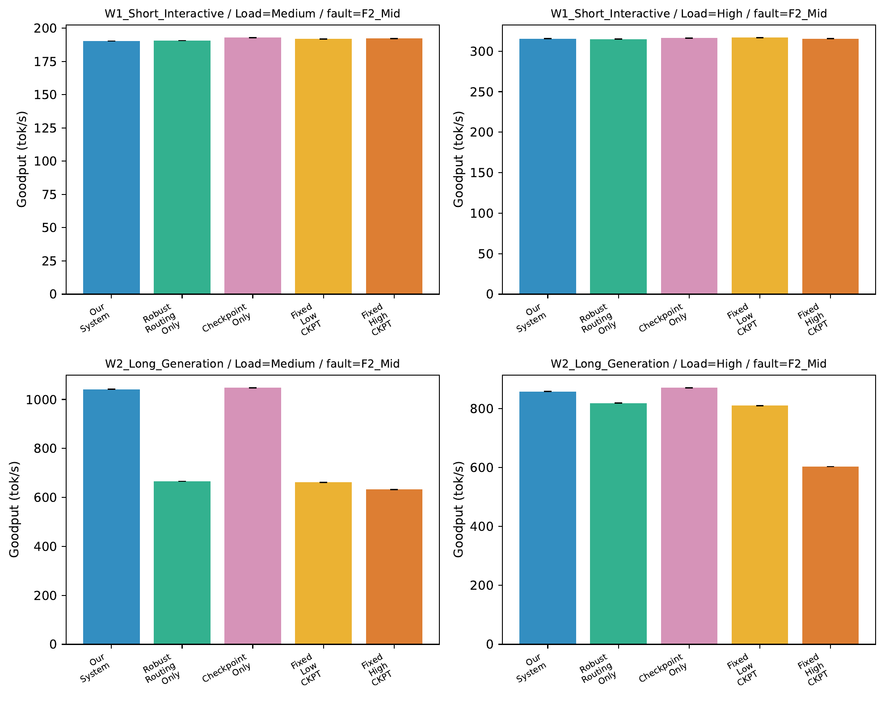
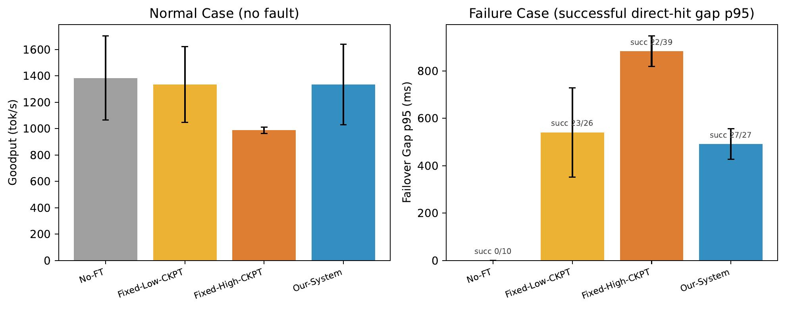
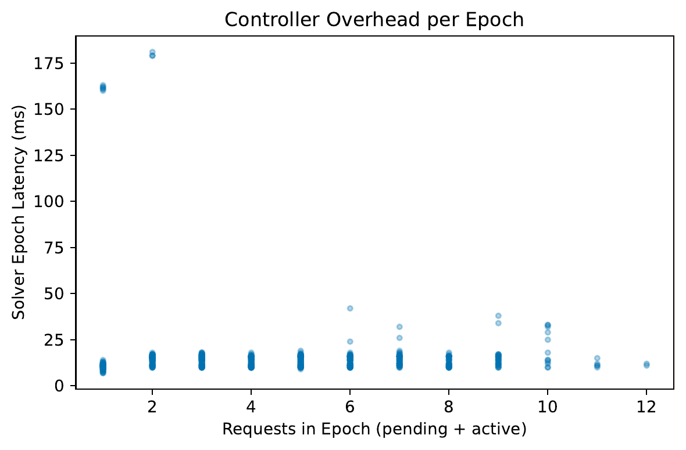

# Fault-Tolerant Multi-GPU LLM Serving with Adaptive KV-Cache Checkpointing

## Progress Update

---

## Slide 1: Scope

All results here are from a **proof-of-concept setup** (1B model, 2 GPUs, synthetic workloads) to validate the end-to-end pipeline. 

Production-scale evaluation (8B model, 4+ GPUs, real datasets) is the next step.

---

## Slide 2: Problem

- Single-node multi-GPU LLM serving: replicas can fail (GPU reset, OOM, driver crash...)
- Failure → capacity loss → interrupted streams, SLO violations, goodput drop
- Naive checkpoint: too frequent = high overhead; too rare = long recovery
- **Core question: how to jointly optimize routing, admission, and adaptive checkpointing to maximize goodput while meeting SLOs under failures?**

---

## Slide 3: Our System

### ① Benders-based Robust Scheduler
- Periodic decision epochs on current system snapshot
- Master problem: admission + routing decisions
- Subproblem: verify recovery feasibility for each failure scenario
- Pooled-flow recovery screening + logic-based cuts

### ② Adaptive Checkpoint Policy
- Runtime-local, per-request, triggered on new stable KV blocks
- Publish when: `Δreplay_costed > Δload + λ·Δckpt_overhead`
- Early in generation: skip (cheap to replay)
- Late in generation: checkpoint (expensive to lose)

### Ablation Matrix

The baselines form a 2×2 ablation on the two core components:

|  | Fixed Checkpoint | Adaptive Checkpoint |
|---|---|---|
| **Greedy Routing** | Fixed-Low-CKPT / Fixed-High-CKPT | Checkpoint-Only |
| **Benders Routing** | Robust-Routing-Only | **Our-System** |

Plus **No-FT** (no fault tolerance at all) as the overhead-free reference.

### Baselines
| Baseline | Routing | Checkpoint | Role |
|---|---|---|---|
| No-FT | Greedy (FCFS) | None | Overhead-free reference (no recovery) |
| Fixed-Low-CKPT | Greedy | Fixed low-freq (every 10 blocks) | Conservative checkpoint baseline |
| Fixed-High-CKPT | Greedy | Fixed high-freq (every 1 block) | Shows "more ckpt ≠ better" |
| Robust-Routing-Only | Benders | Fixed low-freq | Ablation: routing only |
| Checkpoint-Only | Greedy | Adaptive | Ablation: adaptive ckpt only |
| **Our-System** | **Benders** | **Adaptive** | Full system (both components) |

---

## Slide 4: Experiment Setup

### Hardware & Model
- Llama-3.2-1B-Instruct, 2 GPUs (DP replicas), 8GB checkpoint pool (host RAM)

### Workloads
| Workload | Prompt | Output | Arrival |
|---|---|---|---|
| W1 Short Interactive | 50-200 | 20-100 | Poisson |
| W2 Long Generation | 200-500 | 200-500 | Poisson |
| W3 Bursty Mixed | 50-500 | 20-500 | Bursty |

- **Poisson**: requests arrive at a steady average rate with random intervals (stable load)
- **Bursty**: 15s normal rate → 5s at 3× rate → repeat (simulates traffic spikes)

### Load & Faults
- Load: Low (1 rps), Medium (3 rps), High (5 rps)
- Faults: none / F1_Early (15s) / F2_Mid (30s) / F3_Late (50s)
- Duration: 70s per run
- SLO: TTFT 2s, TPOT 100ms, Failover gap 3s

### 5 Experiments
| Experiment | Goal | Key Metrics |
|---|---|---|
| E1: Main | End-to-end comparison | Goodput, SLO violation, failover gap |
| E2: Recovery | Recovery time breakdown | Detection / KV Restore / Replay |
| E3: Ablation | Routing vs Checkpoint contribution | Goodput by component |
| ~~E4: Tradeoff~~ | ~~Checkpoint overhead vs recovery benefit~~ | ~~Goodput + failover gap~~ (covered by E1) |
| E5: Controller | Solver overhead | Solver latency per epoch |

---

## Slide 5: E1 Goodput — No Fault

### Key Points
- All methods ≈ No-FT → **our system has near-zero normal-case overhead**
- Exception: **Fixed-High-CKPT** drops to ~1216 tok/s on W2/High (No-FT ~1715), ~29% loss from copy overhead

---

## Slide 6: E1 Goodput — With Fault (F2_Mid)

### Key Points
- No-FT goodput looks high but it **silently drops fault-hit requests** (completion 97-99%, 0% failover success)
- Our-System matches Fixed-Low on W2/Med (~1040) with 100% completion rate
- Our-System on W2/High: 88.5% completion — lower than No-FT's 97%, but No-FT simply discards failed requests
- Fixed-High-CKPT worst: overhead penalty + slow recovery + low completion (W2/High ~80%)

---

## Slide 7: E1 SLO Violations (F2_Mid)

### Key Points
- With fault: **Fixed-High-CKPT** avg ~7% (worst case 20%+); **Our-System ≈ 0%**
- Without fault: all methods 0% violation (omitted — no differentiation)

---

## Slide 8: E1 Failover Gap (p95)

### Key Points
- No-FT: 0% recovery on W2/W3 (succ 0/34, 0/27)
- Fixed-High-CKPT: highest gap (W2 ~700ms) + lowest success rate (77/117 = 66%)
- **Our-System: moderate gap + highest success rate** (W3: 90/97 = 93%)
- Denominator differs across baselines because different methods have different numbers of in-flight requests at failure time (Fixed-High has more backlog due to overhead)

---

## Slide 9: E2 Recovery Time Breakdown

### Key Points
- **W1 (short tasks)**: Detection dominates (~200ms), all methods similar
- **W2 (long tasks)**: Clear differences
  - Fixed-High-CKPT ~830ms (KV Restore too large)
  - Fixed-Low-CKPT ~350ms
  - **Our-System ~330ms**
- Adaptive checkpoint finds the **sweet spot**: not too much to load, not too much to replay

---

## Slide 10: E3 Ablation — With Fault (F2_Mid)

### Key Points
- **W1 (short tasks)**: All methods similar — short tasks are easy to recover
- **W2/Medium**: Our-System (~1042) ≈ Checkpoint-Only (~1048) >> Robust-Routing-Only (~666)
- **Conclusion: adaptive checkpoint is the primary contributor**; routing benefit is limited at 2-GPU scale, more visible at high load
- Without fault: all methods comparable except Fixed-High-CKPT (−40% on W2/High from copy overhead alone; omitted — same story as Slide 4)

---

## ~~Slide 11: E4 Checkpoint Overhead vs Recovery Benefit~~ (covered by E1, removed)

<!--

### Key Points
- **Left (no-fault goodput)**: Fixed-High-CKPT loses ~29% (988 vs No-FT 1384); others ≈ No-FT
- **Right (fault failover gap + success rate)**:
  - No-FT: 0/10 recovery
  - Fixed-Low: 23/26 (88%), gap ~541ms
  - Fixed-High: 22/39 (56%), gap ~883ms — most checkpointing yet worst recovery
  - **Our-System: 27/27 (100%), gap ~491ms — best on both axes**
- **Core trade-off story: more checkpointing ≠ better**
-->

---

## Slide 12: E5 Controller Overhead

### Key Points
- Median solver latency: **~15ms per epoch**, flat across request counts (1-12)
- For reference: avg request inter-arrival is 200ms @ 5rps — solver is ~10x faster than arrival rate
- Outliers at 160-180ms: cold start (first 1-2 calls), eliminable via warmup
- Solver only runs when new requests arrive, not every decode step -- amortized overhead is low

---

## Slide 13: Summary

### Key Findings
1. **Near-zero normal-case overhead**: goodput matches No-FT
2. **Best under failures**: highest recovery success rate + lowest SLO violations
3. **More checkpointing ≠ better**: Fixed-High hurts both goodput and recovery
4. **Adaptive checkpoint is the primary contributor**; robust routing will matter more at larger scale
5. **Solver overhead is small**: ~15ms per epoch

### Next Steps
- **Real datasets**: replace synthetic workloads with ShareGPT / CNN-DailyMail / Alpaca (real length distributions, heavy-tailed)
- **Async optimization**: solver, checkpoint copy, and RPC are currently synchronous and on the critical path; decouple from the decode loop to reduce TPOT overhead
- **Scale to 8B model on 4 GPUs** (dp=4): losing 1 GPU = 25% capacity loss (more realistic than 50% with dp=2), and routing has more choices → Benders benefit should be more visible
- **Profile solver parameters**: measure actual prefill/decode throughput on target hardware before experiments, instead of using hand-tuned constants
- **Per-request SLO**: assign different TPOT targets per request class (e.g. chat 100ms, summarization 200ms) so Benders can differentiate scheduling
- **3 seeds, 300s runs**: improve statistical significance
