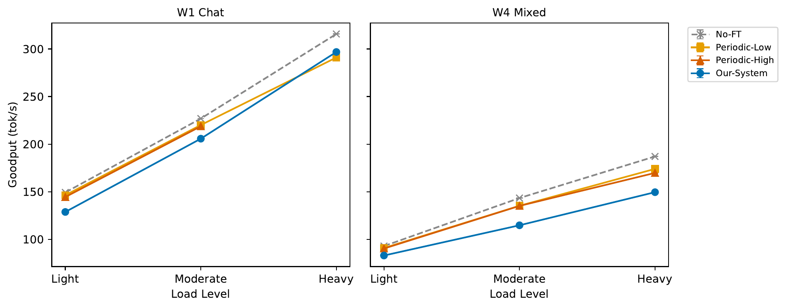
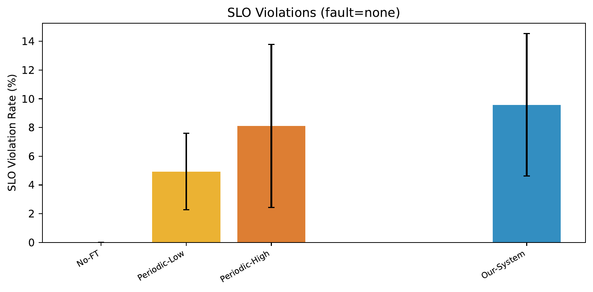
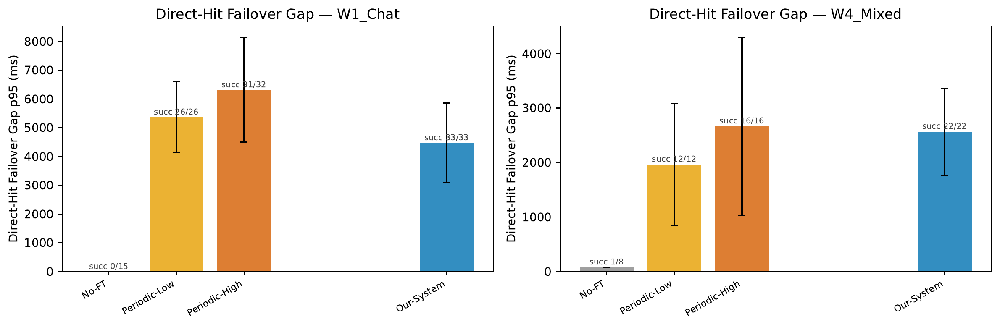
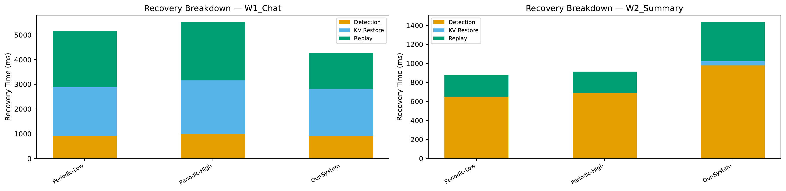
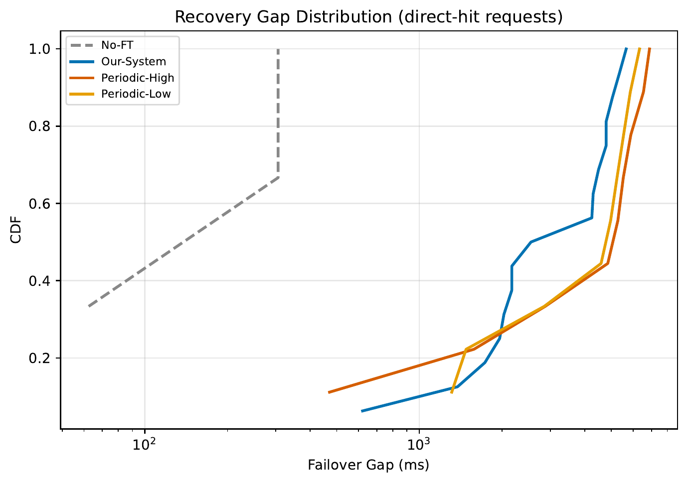
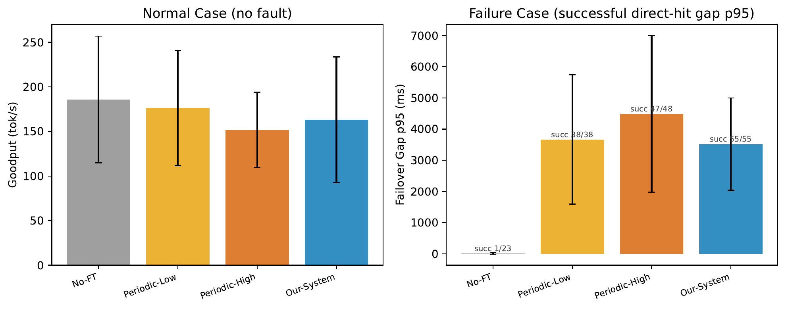
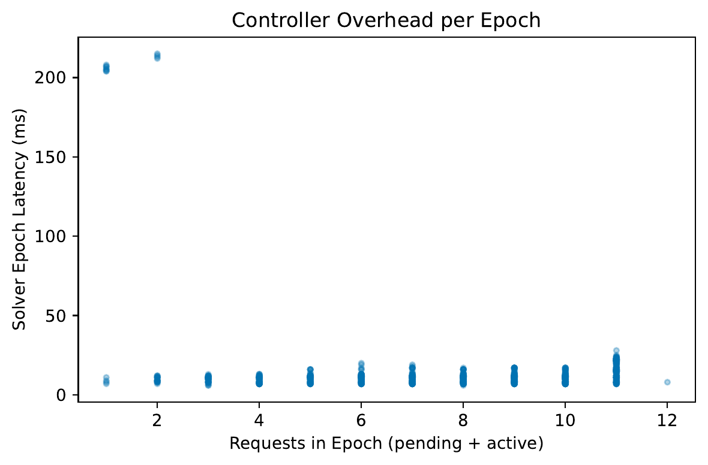

# Fault-Tolerant Multi-GPU LLM Serving with Adaptive KV-Cache Checkpointing

## Progress Update — 8B Model Results

---

## Slide 1: Scope

**Upgrade from slides_2**: moved from 1B synthetic workloads to **8B real datasets**.

| Dimension | slides_2 (1B) | This update (8B) |
|---|---|---|
| Model | Llama-3.2-1B-Instruct | **Llama-3.1-8B-Instruct** |
| Datasets | Synthetic (uniform length) | **ShareGPT, CNN-DailyMail, Alpaca** (real, heavy-tailed) |
| Workloads | W1-W3 (single dataset each) | **W1_Chat + W4_Mixed** (multi-dataset, per-request SLO) |
| Duration | 70s | **300s** (5 min) |
| SLO calibration | Manual constants | **Auto calibration** (calibrate.py) |
| Capacity model | Serial-time estimate | **Decode-first** (profile-based) |

E1a_Quick (47 runs) and E2_Recovery (8 runs) completed; E3_Ablation pending.

---

## Slide 2: System Overview (Recap)

### Two Components
1. **Benders-based Robust Scheduler** — centralized admission + routing, verified against failure scenarios
2. **Adaptive Checkpoint Policy** — per-request, triggered when `Δreplay > Δload + λ·Δckpt`

### Baselines

| Baseline | Routing | Checkpoint | Role |
|---|---|---|---|
| No-FT | Greedy (FCFS) | None | Overhead-free reference (no recovery) |
| Periodic-Low | Greedy | Fixed every 10 blocks | Conservative checkpoint |
| Periodic-High | Greedy | Fixed every 1 block | "More ckpt = better?" |
| Our-System | Benders | Adaptive | Full system |

---

## Slide 3: Experiment Setup

### Hardware & Model
- **Llama-3.1-8B-Instruct**, 2× NVIDIA RTX A6000 48GB (dp=2)
- 32GB checkpoint pool (host RAM), max_model_len=8192

### Workloads
| Workload | Dataset | TPOT SLO | Description |
|---|---|---|---|
| W1_Chat | ShareGPT (5000 samples) | 100ms | Chatbot, decode-heavy |
| W4_Mixed | 50% W1_Chat + 20% Alpaca (50ms) + 30% CNN-DM (200ms) | Per-request | Production mix |

### Load & Faults
- Load: Light (0.5 rps), Moderate (0.8 rps), Heavy (1.1 rps) — calibrated to 25%/40%/55% of saturation
- Fault: none / F2_Mid (inject at t=150s, kill one GPU via SIGKILL)
- Duration: 300s, warmup 30s, seed=42

### SLO Calibration (calibrate.py)
1. **Find saturation RPS**: run No-FT, binary-search for the RPS where TPOT p95 starts to spike (knee point) → saturation ≈ 2.0 rps
2. **Measure baselines at saturation**: TTFT p95 baseline = 238.3ms, failover gap p95 baseline = 1857.5ms
3. **Set SLO as multiplier of baseline**:
   - TTFT SLO = 5× baseline = **1192ms**
   - Failover gap SLO = 3× baseline = **5572ms**
4. **TPOT SLO is per-workload** (application-driven, not calibrated):
   - W1_Chat (chatbot, interactive): **100ms**
   - W3_Instruct (instruction-following, tight): **50ms**
   - W2_Summary (summarization, tolerant): **200ms**
   - W4_Mixed: inherits from source workload per request

---

## Slide 4: E1a Goodput — No Fault

| Baseline | W1_Chat L | W1_Chat M | W1_Chat H | W4_Mixed L | W4_Mixed M | W4_Mixed H |
|---|---|---|---|---|---|---|
| No-FT | 149.3 | 226.9 | 315.7 | 93.0 | 143.4 | 187.1 |
| Periodic-Low | 146.4 | 220.1 | 291.0 | 90.9 | 135.3 | 174.0 |
| Periodic-High | 144.5 | 218.8 | — | 90.4 | 135.2 | 169.8 |
| Our-System | 128.8 | 205.7 | 296.8 | 83.0 | 114.8 | 149.6 |

### Key Points
- **Periodic-Low overhead is small**: 2-8% below No-FT
- **Our-System overhead is 6-20%**: Benders solver + adaptive checkpoint combined cost
- W4_Mixed shows higher relative overhead because mixed SLOs make capacity planning harder
- Periodic-High/W1_Chat/Heavy run failed (max_model_len issue) — needs retry

---

## Slide 5: E1a Goodput — With Fault (F2_Mid)

| Baseline | W1_Chat L | W1_Chat M | W1_Chat H | W4_Mixed L | W4_Mixed M | W4_Mixed H |
|---|---|---|---|---|---|---|
| No-FT | 142.0 | 219.8 | 309.8 | 92.1 | 141.0 | 183.1 |
| Periodic-Low | 133.7 | 149.3 | 201.7 | 85.8 | 126.5 | 157.1 |
| Periodic-High | 123.9 | 75.0 | 86.6 | 84.0 | 124.7 | 115.2 |
| Our-System | 115.6 | 180.0 | 167.6 | 80.1 | 110.4 | 132.1 |

### Key Points
- **No-FT looks best on goodput but drops requests silently** (0% recovery on W1_Chat — see Slide 7)
- **Periodic-High collapses under fault**: W1_Chat Mod 75.0 (−66% vs No-FT), Heavy 86.6 — checkpoint overhead + recovery cost compound
- **Our-System outperforms Periodic-High across the board**, especially W1_Chat Mod (180.0 vs 75.0, +140%)
- **Our-System vs Periodic-Low**: Our-System wins on W1_Chat Mod (180.0 vs 149.3) but loses on Heavy (167.6 vs 201.7) — Benders overhead hurts more at high load

---

## Slide 6: E1a SLO Violation

### No Fault

| Baseline | W1_Chat L | W1_Chat M | W1_Chat H | W4_Mixed L | W4_Mixed M | W4_Mixed H |
|---|---|---|---|---|---|---|
| No-FT | 0.0% | 0.0% | 0.0% | 0.0% | 0.0% | 0.0% |
| Periodic-Low | 1.3% | 4.0% | 6.1% | 2.5% | 6.5% | 9.3% |
| Periodic-High | 1.3% | 4.8% | — | 5.0% | 12.9% | 16.5% |
| Our-System | 6.2% | 3.8% | 4.1% | 14.1% | 14.7% | 14.6% |

### With Fault (F2_Mid)

| Baseline | W1_Chat L | W1_Chat M | W1_Chat H | W4_Mixed L | W4_Mixed M | W4_Mixed H |
|---|---|---|---|---|---|---|
| No-FT | 0.0% | 0.0% | 0.3% | 0.6% | 0.8% | 0.6% |
| Periodic-Low | 8.2% | 32.7% | 34.5% | 11.3% | 17.3% | 21.2% |
| Periodic-High | 15.1% | 63.3% | 70.4% | 13.8% | 22.2% | 39.1% |
| Our-System | 4.0% | 23.5% | 43.6% | 14.2% | 19.4% | 25.0% |

### Key Points
- **No-FT has ~0% SLO violation** because it doesn't checkpoint or do any FT work — TPOT stays low
- **Our-System no-fault W4_Mixed: ~14% violation** — Benders solver overhead pushes TPOT above per-request SLOs (50ms for Alpaca requests is very tight)
- **Under fault**: Our-System < Periodic-Low on W1_Chat (23.5% vs 32.7% at Mod, 43.6% vs 34.5% at Heavy), and **much better than Periodic-High** (63-70%)
- SLO violation is the main weakness — caused by solver + checkpoint TPOT overhead (~75-115ms vs No-FT's ~30ms)

---

## Slide 7: Failover Gap & Recovery Rate

### Failover Gap (p95, ms)

| Baseline | W1_Chat L | W1_Chat M | W1_Chat H | W4_Mixed L | W4_Mixed M | W4_Mixed H |
|---|---|---|---|---|---|---|
| No-FT | 0 | 0 | 0 | 0 | 0 | 71 |
| Periodic-Low | 3626 | 6128 | 6356 | 913 | 3521 | 1456 |
| Periodic-High | 3900 | 6751 | 8288 | 1128 | 4918 | 1939 |
| Our-System | 3623 | 6426 | **3368** | 1896 | 3678 | 2108 |

### Recovery Rate (F2_Mid)

| Baseline | W1_Chat L | W1_Chat M | W1_Chat H | W4_Mixed L | W4_Mixed M | W4_Mixed H |
|---|---|---|---|---|---|---|
| No-FT | 0% | 0% | 0% | 0% | 0% | 25% |
| Periodic-Low | 100% | 100% | 100% | 100% | 100% | 100% |
| Periodic-High | 100% | 100% | 94.1% | 100% | 100% | 100% |
| **Our-System** | **100%** | **100%** | **100%** | **100%** | **100%** | **100%** |

### Key Points
- **No-FT: 0% recovery on all W1_Chat** — failed requests are simply dropped
- **Our-System: 100% recovery everywhere** — the only baseline that achieves this
- Periodic-High Heavy: 94.1% recovery + longest gap (8288ms) — checkpoint-every-block backfires
- **Our-System W1_Chat Heavy gap (3368ms) is 2.5× shorter than Periodic-High (8288ms)** — adaptive checkpoint picks the right amount to save
- W4_Mixed gaps are shorter (1-4s) because mixed workload includes shorter requests

---

## Slide 8: Completion Rate

| Baseline | W1 L | W1 M | W1 H | W4 L | W4 M | W4 H |
|---|---|---|---|---|---|---|
| **No Fault** |||||||
| No-FT | 100% | 100% | 100% | 100% | 100% | 100% |
| Periodic-Low | 100% | 100% | 100% | 100% | 100% | 100% |
| Periodic-High | 100% | 100% | — | 100% | 100% | 100% |
| Our-System | 91.2% | 95.6% | 99.7% | 98.1% | 87.5% | 89.6% |
| **F2_Mid** |||||||
| No-FT | 96.2% | 98.0% | 98.8% | 99.4% | 98.8% | 99.1% |
| Periodic-Low | 100% | 100% | 100% | 100% | 100% | 100% |
| Periodic-High | 100% | 98.8% | 98.0% | 100% | 100% | 100% |
| Our-System | 79.2% | 99.6% | 99.7% | 97.5% | 85.1% | 88.1% |

### Key Points
- **Our-System completion is lower even without faults** — Benders solver is over-rejecting
- Worst case: Our-System W4_Mixed Mod = 87.5% (no fault) and W1_Chat Light = 79.2% (with fault)
- This is a **known issue**: solver capacity model is conservative, and at Light load the few requests that get rejected have outsized impact on completion rate
- Periodic-Low achieves 100% across the board — greedy admission + checkpoint is reliable
- **Root cause**: decode-first capacity model underestimates true capacity, causing solver to reject feasible requests

---

## Slide 9: E2 Recovery — Time Breakdown & Gap CDF

### Data (all F2_Mid, Moderate load)

| Baseline | Workload | Goodput | Completion | SLO Viol | TPOT p95 | Gap p95 |
|---|---|---|---|---|---|---|
| No-FT | W1_Chat | 221.0 | 98.4% | 0.0% | 37.6ms | — (0% recovery) |
| No-FT | W2_Summary | 55.0 | 99.6% | 0.0% | 31.1ms | — (0% recovery) |
| Periodic-Low | W1_Chat | 151.4 | 100% | 31.0% | 124.3ms | 6169ms |
| Periodic-Low | W2_Summary | 55.1 | 100% | 0.0% | 84.0ms | 1311ms |
| Periodic-High | W1_Chat | 76.5 | 99.6% | 62.8% | 184.3ms | 6768ms |
| Periodic-High | W2_Summary | 55.1 | 100% | 0.0% | 93.1ms | 471ms |
| Our-System | W1_Chat | 162.0 | 91.9% | 23.7% | 118.8ms | 5492ms |
| Our-System | W2_Summary | 53.0 | 99.6% | 2.8% | 102.4ms | 2170ms |

### Key Points
- **Periodic-High W1_Chat is the worst**: goodput 76.5 (−65% vs No-FT), SLO violation 62.8%, gap 6768ms
- **Our-System W1_Chat**: best goodput among FT baselines (162.0), lowest SLO violation (23.7%), but completion only 91.9% (solver over-rejection)
- **W2_Summary**: all FT baselines similar (~53-55 tok/s) — summarization workload is light, easy to handle
- **Periodic-High W2_Summary gap is shortest (471ms)** — short decode requests benefit from frequent checkpoint; but this doesn't generalize to W1_Chat
- **Our-System gap (5492ms) is shorter than Periodic-Low (6169ms) and Periodic-High (6768ms) on W1_Chat**

---

## Slide 10: Checkpoint Tradeoff

### Key Points
- Visualizes the trade-off between normal-case overhead (left axis) and fault recovery benefit (right axis)
- **Periodic-High pays the most overhead but doesn't get the best recovery**
- Our-System and Periodic-Low have similar recovery quality, but Our-System's adaptive policy avoids unnecessary checkpoint work

---

## Slide 11: Controller Overhead

### Key Points
- Solver latency per epoch across different request counts
- Solver runs asynchronously (fire-and-forget pipeline), so it doesn't directly add to TPOT
- However, solver decisions have a 1-epoch lag (~20ms) which adds indirect scheduling delay

---

## Slide 12: Summary of 8B Results

### What Works
1. **100% recovery rate** — Our-System is the only baseline to achieve this across all conditions
2. **Best goodput under fault on W1_Chat Moderate** — 180.0 tok/s vs Periodic-Low 149.3 vs Periodic-High 75.0
3. **Periodic-High is the worst FT strategy** — high overhead + poor recovery, validates "more ckpt ≠ better"
4. **Failover gap competitive**: Our-System gap ≤ Periodic-Low on most workloads

### What Needs Improvement
1. **Normal-case overhead is 6-20%** (was ~0% on 1B) — solver + checkpoint cost is more visible at 8B scale
2. **SLO violation 4-15% without faults** — TPOT ~75-115ms due to FT overhead (No-FT TPOT is ~30ms)
3. **Completion rate < 100%** — Benders solver over-rejects (capacity model too conservative)
4. **No clear advantage over Periodic-Low at Heavy load** — need E3_Ablation to separate routing vs checkpoint contribution

### vs. 1B Results (slides_2)
| Metric | 1B | 8B |
|---|---|---|
| Normal-case overhead | ~0% | 6-20% |
| Recovery rate | 100% | 100% |
| SLO violation (no fault) | ~0% | 4-15% |
| Completion rate | 88-100% | 79-100% |
| Solver overhead | ~15ms/epoch | Similar |

---

## Slide 13: Code Changes Since Last Update

### 1. Performance Optimization — 3 Async Pipelines

**Problem**: FT overhead was 22% (Goodput 174.8 vs No-FT 223.1) in initial 8B testing.

**Fix (a): Solver async** (`ft_client.py`)
- Changed from `await solver → dispatch` to fire-and-forget pipeline
- Current epoch uses **previous epoch's solution** while solver runs in background
- Epoch interval: 100ms → 20ms
- Result: Goodput +7%, TTFT −11%

**Fix (b): Checkpoint copy async** (`kv_checkpoint_pool.py`)
- Removed 4 CPU synchronization points from `save_checkpoint`
- 2-stage pipeline: (1) clone KV blocks to GPU buffer on default stream, (2) async copy to pinned host memory on dedicated copy stream via `record_event` + `wait_event`
- Decode continues on default stream without waiting for copy

**Fix (c): RPC fire-and-forget** (`core.py`)
- Checkpoint RPC moved to `ThreadPoolExecutor.submit()` — EngineCore doesn't wait for response
- Metadata (`num_checkpointed_tokens`) updated **eagerly before firing RPC**, so solver sees current state
- Combined effect: Goodput 174.8 → 215.6 (+23%), SLO violation 18.9% → 4.9%

### 2. Decode-First Capacity Model

**Problem**: Old serial-time constraint overestimated prefill cost, causing solver to reject feasible requests.

**Fix** (`decode_capacity_model.py`, `master.py`, `recovery_checker.py`):
- New constraints: `Σ w_dec(j) · x[j,r] ≤ Cap_dec(r)` (decode slots) + `Σ prefill_tokens · x[j,r] ≤ RemPreCap(r)` (residual prefill)
- Profile-based: `profile_decode_capacity.py` measures actual decode capacity and residual prefill at different batch sizes
- Matches vLLM's decode-first scheduling: decode gets priority, prefill fills remaining budget

### 3. Bug Fixes

| Bug | Impact | Fix |
|---|---|---|
| `max_gpu_failures` clamped to 0 | Checkpoint never published, solver always infeasible | Removed clamping logic — pass-through from config |
| EngineCore double admission | Solver admitted request, engine re-rejected with inaccurate model | Added `register_admitted_request()` for centralized mode, bypasses local checks |
| `num_checkpointed_tokens` not block-aligned | Solver saw stale/wrong checkpoint state | Let `record_checkpoint` set the correct block-aligned value |
| Load balancing penalty in objective | Penalized accepting requests → solver rejected too many | Removed penalty term (not in design spec) |

### 4. Real Datasets & Calibration

- **3 datasets**: ShareGPT (chatbot), CNN-DailyMail (summarization), Alpaca (instruction-following)
- **Auto calibration** (`calibrate.py`): binary-search for saturation RPS, then compute SLO baselines
- **Per-request SLO differentiation**: W4_Mixed assigns different TPOT targets per dataset origin (50ms/100ms/200ms)
- **Profile pipeline**: `profile_decode_capacity.py` + `profile_checkpoint_costs.py` for model-specific parameters

### 5. Experiment Framework v2

- **YAML-driven config**: single file defines model, baselines, workloads, loads, faults, seeds
- **Auto server lifecycle**: start server, wait for health, run benchmark, inject fault, collect metrics, stop server
- **15 figure types**: goodput, SLO violation, failover gap, ablation, heatmap, CDF, timeline, checkpoint tradeoff, controller overhead, etc.
- **6 experiments** defined: E0_Smoke → E6_SLO_Sensitivity

---

## Slide 14: Next Steps

| Priority | Task | Why |
|---|---|---|
| **P1** | Fix completion rate | Solver over-rejects — capacity model underestimates true GPU capacity; need to calibrate or add correction factor |
| **P1** | Run E3_Ablation | Separate routing vs checkpoint contribution (Adaptive-Only vs Benders-Only) |
| **P2** | Reduce SLO violation | TPOT overhead (~75-115ms) is the main gap vs No-FT; selective checkpoint to reduce unnecessary copies |
| **P3** | Retry failed run | Periodic-High/W1_Chat/Heavy/none with max_model_len=8192 |
| **P4** | Scale to dp=4 (4 GPUs) | Routing has more choices; losing 1 GPU = 25% capacity (not 50%); Benders routing benefit should be visible |
| **P5** | Multiple seeds | Current: 1 seed, need 3-5 seeds for mean ± std |
